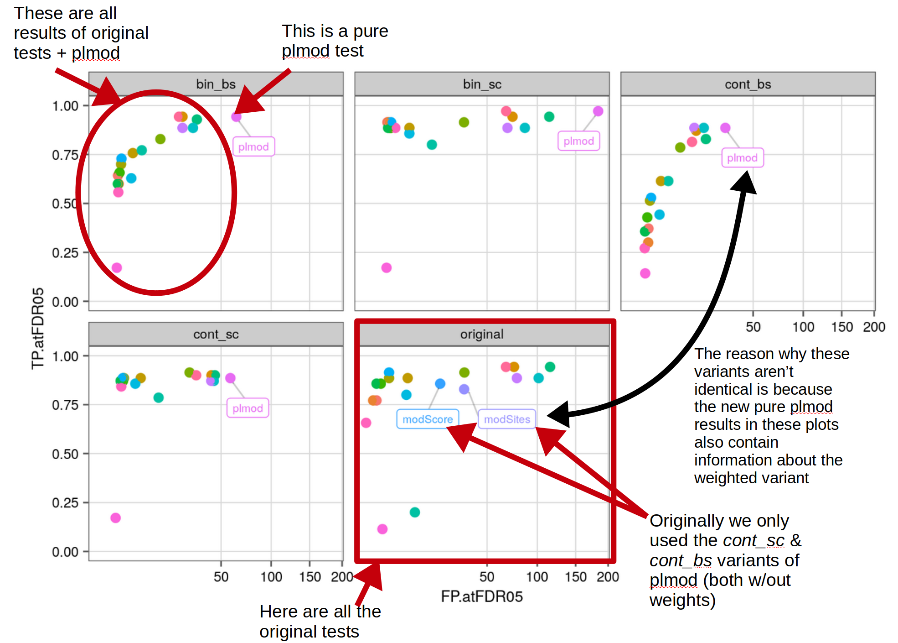

<style>
  .main-container {
    max-width: 1500px !important;
  }
</style>


```{r setup, include=FALSE}
knitr::opts_chunk$set(echo = TRUE)
```

# TLDR

## Questions to be answered:  

1a) Does a secondary *glm()* or *lm()* improve the scores we get from running a primary test on its own?  
1b) If so, is any of those better than the original *regmir* (pure *regmir*)?  
2) What are the runtimes of the new *regmirs* compared to the original?  
3) Are the findings consistent across datasets?  
4a) Which variant performs best? OR Which variant to choose as default operation?  
4b) For each test: Which variant performs best?   

--> In other words: is it worth implementing a separate *regmir* variant based on any of the other tests? If so, which one?  

## Spoilers (new *co*):  

1a) We get an increase in specificity while sensitivity either stays the same or decreases (see [here](#overview)).  
1b) We get higher sensitivities with other primary tests when using the *bin_cont* variant. Otherwise the original *regmir* performs best. Other tests that come close are *modScore* and *michael* (*siteoverlap*) (see [here](#overview)).    
2) really depends: the *glmnet()* regression that *regmir* uses can be fast or very slow depending on the data. We can thus only say that the runtimes of an alternative would probably be more consistently slow or fast across different datasets (see [here](#runtimes)).  
3) In datasets *jeong* & *cherone* all tests perform badly.      
4a) Among the single primary tests the original variant (regmir pure) performs best: [*regmir cont_cont w/out weights*](#default). *regmir* is currently our [slowest test](#runtimes) (depending on the dataset; for a more in-depth look at runtimes see *enrichMiR_runtimes.html*).  
4b) Check [this table](#top_vars).  


## Spoilers (old *co*):  

A comparison of new vs. old *co*-selection method can be found [here](#co). Apart from that, only the new method is shown.    

1a) Yes, we get an increase in specificity in every case and an increase in sensitivity in some. Tests that on their own perform relatively badly benefit the most and are able to catch up to better performing ones. Overall, the difference between tests gets diminished (see [here](#overview)).  
1b) Yes. A sole *regmir* run (not contingent on any other primary tests) with binary signal & variables (bin_bin) outperforms all alternative combined variants. In all other cases sole *regmir* performs as good or worse than other variants (see [here](#overview)).    
2) really depends: the *glmnet()* regression that *regmir* uses can be fast or very slow depending on the data. We can thus only say that the runtimes of an alternative would probably be more consistently slow or fast across different datasets (see [here](#runtimes)).  
3) Yes, we see similar patterns for each variant across datasets. In all datasets but Rat cont_cont & cont_bin variants perform almost equally well. In Rat however, cont_bin outperforms cont_cont (see [here](#rat)).    
4a) [*aREAmir cont_bin w/ logCPM weights*](#default) when focusing on sensitivity OR [*aREAmir cont_cont w/out weights*](#default) when focusing on specificity (aREAmir is currently our [fastest test](#runtimes)). I'd suggest the latter. If that turns out to not be specific enough, use *combGeom.3 cont_cont w/out weigths* (*combGeom.3* being an aggregation of *michael*, *aREAmir* & *regmirb*).        
4b) Check [this table](#top_vars).  


# Prep

```{r}
regBench <- function(file, tps, add.exp=FALSE){
  source("../functions/runBenchmark.R")
  res <- readRDS(file)
  # load different file to get experiment names... (ideally we already have this)
  if(add.exp){
    if(grepl("bartel|cherone", file)){
      n <- strsplit(rev(strsplit(file,split="\\/")[[1]]), split="\\.")[[1]][1:2]
      n <- paste(n, collapse=".")
    } else {
      n <- strsplit(rev(strsplit(file,split="\\/")[[1]]), split="\\.")[[1]][1]
    }
    n <- paste0("../results/", n, ".enrichMiR.rds")
    res.orig <- readRDS(n)
    names(res) <- names(res.orig)
    saveRDS(res, file)
  }
  # this is specifically for pure regmir enrichMiR runs
  if(grepl("regmir_pure",file) & !any(sapply(res[[1]],is.list))){
    for(i in names(res)){
      tmp <- res[[i]]
      res[[i]] <- NULL
      res[[i]]$regmir <- tmp
      saveRDS(res, file)
    }
  }
  # do benchmark
  return( getBench(res, tps[names(res)], e.obj = FALSE) )
}
```

```{r}
TPs <- c( 
  let.7a = "GAGGUAG", lsy.6 = "UUUGUAU", miR.1 = "GGAAUGU", miR.124 = "AAGGCAC", 
  miR.137 = "UAUUGCU", miR.139 = "CUACAGU", miR.143 = "GAGAUGA", 
  miR.144 = "ACAGUAU", miR.153 = "UGCAUAG", miR.155 = "UAAUGCU", 
  miR.182 = "UUGGCAA", miR.199a = "CCAGUGU", miR.204 = "UCCCUUU", 
  miR.205 = "CCUUCAU", miR.216b = "AAUCUCU", miR.223 = "GUCAGUU", 
  miR.7 = "GGAAGAC", miR.122 = "GGAGUGU", miR.133 = "UGGUCCC", 
  miR.138 = "GCUGGUG", miR.145 = "UCCAGUU", miR.184 = "GGACGGA", 
  miR.190a = "GAUAUGU", miR.200b = "AAUACUG", miR.216a = "AAUCUCA", 
  miR.217 = "ACUGCAU", miR.219a = "GAUUGUC", miR.375 = "UUGUUCG", 
  miR.451a = "AACCGUU", "DKOvWT"="GCUACAU", "DKO"="GCUACAU", 
  "miR.138vNeg"="GCUGGUG", "miR.499vNeg"="UAAGACU", "miR.499"="UAAGACU", 
  "218DKOvWT"="UGUGCUU", "218DKO"="UGUGCUU",
  "138DKOvWT"="GCUGGUG", "138DKO"="GCUGGUG"
)
```

```{r}
getBenchLists <- function(path, pattern=".regmir."){
  files <- list.files(path, pattern=".regmir.", full.names=TRUE)
  d.list <- lapply(files, function(file) regBench(file, TPs))
  
  n.files <- sapply(files, function(f){
    if(grepl("bartel|cherone",f)){
      n <- strsplit(rev(strsplit(f,split="\\/")[[1]]), split="\\.")[[1]][-3]
    } else {
      n <- strsplit(rev(strsplit(f,split="\\/")[[1]]), split="\\.")[[1]][-2]
    }
    paste(n, collapse=".")
    })
  names(d.list) <- n.files
  return(d.list)
}
```

```{r}
# load regmir test combinations
d.list <- getBenchLists(path="../results_regmir2/")
# load regmir pure
d.list2 <- getBenchLists(path="../results_regmir2/regmir_pure")
```

```{r}
df <- dplyr::bind_rows(d.list, .id="id")
df <- df[!grepl("regmir",df$method),]
df2 <- dplyr::bind_rows(d.list2, .id="id")
```

```{r}
# add original test results
originals <- c("../results/bartel.hek.benchmark.rds",
               "../results/bartel.hela.benchmark.rds",
               "../results/amin.benchmark.rds",
               "../results/jeong.benchmark.rds",
               "../results/ratPolyA.benchmark.rds",
               "../results/cherone.d0.benchmark.rds",
               "../results/cherone.d1.benchmark.rds")
d.list3 <- lapply(originals,readRDS)
names(d.list3) <- sapply(originals, function(x) rev(strsplit(x,split="\\/")[[1]])[1])
df3 <- dplyr::bind_rows(d.list3, .id="id")
df3 <- df3[df3$prop=="original",]
```

```{r, eval=FALSE}
# # rerun benchmark for cherone.d0 (got corrupted)
# cherone.e <- readRDS("/mnt/schratt/tgermade_test/master_19_20/enrichMiR_benchmark/results/cherone.d0.enrichMiR.rds")
# cherone.bm <- getBench(cherone.e, TPs[names(cherone.e)], perm=TRUE, e.obj=TRUE)
# saveRDS(cherone.bm, "/mnt/schratt/tgermade_test/master_19_20/enrichMiR_benchmark/results/cherone.d0.benchmark.rds")
# test <- readRDS("../master_19_20/enrichMiR_benchmark/results/cherone.d0.benchmark.rds")
```

```{r}
# combine all benchmarks
df <- rbind(df, df2, df3[,-c(3,10)])
```

```{r}
# prep
df$dataset <- "bartel.hela"
df$dataset[grepl("bartel.hek",df$id)] <- "bartel.hek"
df$dataset[grepl("amin",df$id)] <- "amin"
df$dataset[grepl("jeong",df$id)] <- "jeong"
df$dataset[grepl("ratPolyA",df$id)] <- "rat"
df$dataset[grepl("cherone.d0",df$id)] <- "cherone.d0"
df$dataset[grepl("cherone.d1",df$id)] <- "cherone.d1"
df$reg.var <- sapply(df$id, function(x){
  if(grepl("benchmark",x)){
    "original"
  } else {
    if(grepl("bartel|cherone",x)){
      strsplit(x, split="\\.")[[1]][3]
    } else {
      strsplit(x, split="\\.")[[1]][2]
    }
  }
})
df$weight <- "logCPM"
df$weight[!grepl("\\.w\\.",df$id)] <- "NULL"
df$coeff <- sapply(df$id, function(x){
  if(grepl("\\.c\\.",x)){
    "constrained"
  } else if(grepl("\\.nc\\.",x)){
    "unconstrained"
  } else "NULL"
})


w.up <- grepl("\\.up",df$method) 
df <- df[!(w.up & df$dataset!="jeong"),]
w.down <- grepl("\\.down",df$method)
df <- df[!(w.down & df$dataset=="jeong"),]
df$method <- gsub("\\.up","",gsub("\\.down","",df$method))
```

# Results

```{r, warning=F,message=F}
source("../functions/bmPlots.R")
```

{#id .class width=80% height=80%}  

## Overview {#overview}

```{r, warning=F,message=F, fig.width=9}
# overview: compare new regmirs to original tests
TPvFP(df, features=c("reg.var"), labels=c("regmir","regmirb"))
```

## Each dataset separately {#rat}

```{r, warning=F,message=F, fig.height=7, fig.width=9}
# compare regmir variants
TPvFP(df[grepl("bartel",df$dataset),], features=c("reg.var","dataset"), labels=c("regmir","regmirb"))
```
```{r, warning=F,message=F, fig.height=5, fig.width=9}
TPvFP(df[grepl("amin",df$dataset),], features=c("reg.var","dataset"), labels=c("regmir","regmirb"))
```
```{r, warning=F,message=F, fig.height=5, fig.width=9}
TPvFP(df[grepl("jeong",df$dataset),], features=c("reg.var","dataset"), labels=c("regmir","regmirb"))
```
```{r, warning=F,message=F, fig.height=5, fig.width=9}
TPvFP(df[grepl("rat",df$dataset),], features=c("reg.var","dataset"), labels=c("regmir","regmirb"))
```
```{r, warning=F,message=F, fig.height=5, fig.width=9}
TPvFP(df[grepl("cherone",df$dataset),], features=c("reg.var","dataset"), labels=c("regmir","regmirb"))
```

## Effect of weights

```{r, warning=F,message=F, fig.width=9}
# check effect of weights
TPvFP(df[df$reg.var!="original",], label.all=TRUE, features=c("weight"))
```
```{r, warning=F,message=F, fig.height=7, fig.width=9}
# look at the effect of weights on each of the separate input types
TPvFP(df, features=c("reg.var","weight"), labels=c("regmir","regmirb"))
```

## Effect of coefficient restriction

```{r, warning=F,message=F, fig.width=9}
# check effect of coefficient constriction in logistic models
TPvFP(df[df$reg.var!="original" & df$reg.var %in% c("bin_bin","bin_cont"),], label.all=TRUE, features=c("coeff"))
```
```{r, warning=F,message=F, fig.height=7, fig.width=9}
# look at the effect of coefficient restriction on each of the separate input types
TPvFP(df, features=c("reg.var","coeff"), labels=c("regmir","regmirb"))
```

## Top 10 % performing variants

### Variants  

The higher the following ratios the better. They represent the combined rankings of TP and FP of regmir variants among the top 10%.  

```{r, warning=F,message=F}
# rank regmir variants based on TP & FP
ag <- aggregate(df[,c("FP.atFDR05","TP.atFDR05","detPPV")], by=df[,c("reg.var","method","coeff","weight")], FUN=mean, na.rm=T)

rank <- data.frame(FP=rownames(ag[order(ag$FP.atFDR05, ag$detPPV, decreasing=c(F,T)),]),
                   TP=rownames(ag[order(ag$TP.atFDR05, ag$detPPV, decreasing=TRUE),])
                   )
rank <- sapply(1:nrow(rank), function(i) which(rank$FP==i) + which(rank$TP==i))
ag <- ag[order(rank),]
```

For each variant, what's the ratio of total measured instances of this variant in the top 10%?  

```{r, warning=F,message=F}
# ratio of regmir instances in the top 10% ranks [vs. individual sizes of each regmir variant]
round( table(ag$reg.var[1:floor(nrow(ag)/10)]) / table(ag$reg.var)[-c(1:2)] ,2)
```

How the top 10% are split up in terms of variants. When summed, they give 100%.  

```{r, warning=F,message=F}
# ratio of regmir instances in the top 10% ranks [vs. number of ranks that make up the top 10%]
round( table(ag$reg.var[1:floor(nrow(ag)/10)]) / sum(table(ag$reg.var[1:floor(nrow(ag)/10)])) ,2)
```

### Weights  

For each variant, what's the ratio of total measured instances of this variant in the top 10%?  

```{r, warning=F,message=F}
# ratio of weight variants in the top 10% ranks [vs. individual sizes of each weight variant]
round( table(ag$weight[1:floor(nrow(ag)/10)]) / table(ag$weight) ,2)
```

How the top 10% are split up in terms of variants. When summed, they give 100%:  

```{r, warning=F,message=F}
# ratio of weight variants in the top 10% ranks [vs. number of ranks that make up the top 10%]
round( table(ag$weight[1:floor(nrow(ag)/10)]) / sum(table(ag$weight[1:floor(nrow(ag)/10)])) ,2)
```

Sum of ranks per variant over all runs (not just top 10%):  

```{r, warning=F,message=F}
# sum of ranks for weight variants (the smaller the number the better)
c(logCPM=sum(which(ag$weight=="logCPM")), `NULL`=sum(which(ag$weight=="NULL")))
```

Looking at the top 10% performing tests, we see an advantage for no_weights. Looking at all ranks combined, separated by weight variants, we see a very slight advantage for weights. Should we implement defaults for every primary test option individually? Or simply take logCPM weights?  

### Coeff constraints  

Coefficient constraints only apply to binary signal variants. These variants don't perform well, comparatively (there are no binary signal variants under the top 10% performing ones). 

```{r, warning=F,message=F}
# sum of ranks for weight variants (the smaller the number the better)
ag2 <- ag[grepl("bin_",ag$reg.var),]
c(constrained=sum(which(ag2$coeff=="constrained")), unconstrained=sum(which(ag2$coeff=="unconstrained")))
```

When running variants with binary signal, use constrained coefficients when in doubt.  

### Tables {#default}  

Table of top 10% performing variants:  

```{r, warning=F,message=F}
# top ranks of aggregated table
head(ag, floor(nrow(ag)/10))
```

Table of top 10% binary signal variants (to showcase impact of coefficient constraint option):  

```{r, warning=F,message=F}
# top ranks of aggregated table
head(ag2, floor(nrow(ag2)/10))
```

## Top variant for each test {#top_vars}  

```{r}
do.call(rbind, lapply(unique(ag$method), function(x) ag[ag$method==x,][1,]))
```

## Heatmaps  

```{r, warning=F,message=F, fig.height=6, fig.width=7}
HM(df, form=method~reg.var+coeff+weight, cluster.cols = T)
HM(df, metric="FP.atFDR05", form=method~reg.var+coeff+weight, cluster.cols = T)
```

## Runtime Analysis {#runtimes}  

We used to define *co* based on the miRNAs that pass as significant. This meant *co* lengths and thus the number of variables that were tested in a secondary test (here *regmir*) differed for every primary test (i.e. using *regmir* as primary test might result in a smaller *co* than using *areamir*). Now we define *co* based on a top percentage of miRNAs (in terms of FDR & pvalue). This means that *co* lengths are largely identical for all tests. This means that we expect to see smaller differences in the performances between each variant (defined by their different primary tests).  

These are the codes for both versions:  

```{r, eval=FALSE}
# old: 
if( sum(e$FDR<=.05,na.rm=TRUE) > 0 ){
  co <- rownames(e[e$FDR<=.05,])
} else if( sum(e$FDR<=.2) > 0 ){
  co <- rownames(e[e$FDR<=.2,])
} else if( nrow(e) >= 10 ) {
  co <- rownames(e[1:10,])
} else {
  co <- rownames(e[1:nrow(e),])
}
```

```{r, eval=FALSE}
# new:
if( nrow(e) >= 5 ){
  co <- head(rownames(e),n=max(5,ceiling(nrow(e)/10)))
} else {
  co <- rownames(e)
}
```

### Time for each test individaully

```{r, warning=F, message=F}
rts <- readRDS("../results_runtime/combined.runtimes.rds")
names(rts) <- nd <- c("amin","bartel.hek","bartel.hela","jeong")
```

```{r}
formDF <- function(l){
  df <- as.data.frame(dplyr::bind_rows(l, .id="id"))
  df2 <- stack(df[!colnames(df) %in% "id"])
  df2$id <- factor(df$id)
  df2$test <- factor(rownames(l[[1]]))
  return(df2)
}
```

```{r}
rdf1 <- formDF(rts[nd[c(1,4)]])
rdf2 <- formDF(rts[nd[-c(1,2,4)]])
rdf3 <- formDF(rts[nd[-c(1,3,4)]])
```

```{r, warning=FALSE, message=FALSE}
# combine runtimes of all datasets
rdf <- rbind(rdf1,rdf2,rdf3)
rdf <- rdf[!grepl(".old",rdf$test),]
ag <- aggregate(rdf[,"values"], by=list(rdf[,"test"]), FUN=mean)
nt <- ag[,1]
ag <- ag[,-1]
names(ag) <- nt
round(ag[order(ag)],1)
```

All values are in seconds per run. The *areamir* test is by far the fastest. A more detailed analysis of runtimes can be found in *enrichMiR_runtimes.html*.   

# Comparing old & new variable selection (*co*) {#co}     

```{r}
# load regmir test combinations
od.list <- getBenchLists(path="../results_regmir/")
# load regmir pure
od.list2 <- getBenchLists(path="../results_regmir/regmir_pure")
```

```{r}
odf <- dplyr::bind_rows(od.list, .id="id")
odf <- odf[!grepl("regmir",odf$method),]
odf2 <- dplyr::bind_rows(od.list2, .id="id")
```

```{r}
odf <- rbind(odf, odf2)
```

```{r}
# prep
odf$dataset <- "bartel.hela"
odf$dataset[grepl("bartel.hek",odf$id)] <- "bartel.hek"
odf$dataset[grepl("amin",odf$id)] <- "amin"
odf$dataset[grepl("jeong",odf$id)] <- "jeong"
odf$dataset[grepl("ratPolyA",odf$id)] <- "rat"
odf$dataset[grepl("cherone.d0",odf$id)] <- "cherone.d0"
odf$dataset[grepl("cherone.d1",odf$id)] <- "cherone.d1"
odf$reg.var <- sapply(odf$id, function(x){
  if(grepl("benchmark",x)){
    "original"
  } else {
    if(grepl("bartel|cherone",x)){
      strsplit(x, split="\\.")[[1]][3]
    } else {
      strsplit(x, split="\\.")[[1]][2]
    }
  }
})
odf$weight <- "logCPM"
odf$weight[!grepl("\\.w\\.",odf$id)] <- "NULL"
odf$coeff <- sapply(odf$id, function(x){
  if(grepl("\\.c\\.",x)){
    "constrained"
  } else if(grepl("\\.nc\\.",x)){
    "unconstrained"
  } else "NULL"
})


w.up <- grepl("\\.up",odf$method) 
odf <- odf[!(w.up & odf$dataset!="jeong"),]
w.down <- grepl("\\.down",odf$method)
odf <- odf[!(w.down & odf$dataset=="jeong"),]
odf$method <- gsub("\\.up","",gsub("\\.down","",odf$method))
```

```{r}
df$co <- "new_co"
odf$co <- "old_co"
combdf <- rbind(df,odf)
```

## all variants  

```{r, warning=F,message=F, fig.width=9}
# check effect of different feature selection (co) in logistic models
TPvFP(combdf[combdf$reg.var!="original",], label.all=TRUE, features=c("co"))
```

The old *co* is very different for each variant. The new one is by definition very similar among them: It takes the top 10% miRNAs and feeds them into the secondary regression. It is unsurprising that the spread of the results is thus much more narrow. It also means that the *co*s are larger in most cases, leading to a decrease in specificity with a very mild increase in sensitivity in some cases. It might be worth considering decreasing the percentage of miRNAs we select in this specific case or to return to the old *co*-selection method.     

## continuous signal variants  

```{r, warning=F,message=F, fig.width=9}
# check effect of different feature selection (co) in logistic models
TPvFP(combdf[combdf$reg.var!="original" & combdf$reg.var %in% c("cont_cont","cont_bin"),], label.all=TRUE, features=c("co"))
```

Here we only look at the variants with continuous signals, which performed best in most of our metrics. We see very similar tendencies as described above (all variants combined). *areamir* is no longer one of the best primary test options.  

# Comparing old & new pure regmir runs

The original regmir runs should be *bin_cont* (regmir) & *bin_bin* (regmirb) w/out weights & w/ constrained coefficients. See here:  

```{r, eval=FALSE}

# enrichMiR.R

## creates binary signal
down <- .dea2binary(DEA, th=th.FDR, th.alfc=th.abs.logFC, restrictSign=-1, ...)
up <- .dea2binary(DEA, th=th.FDR, th.alfc=th.abs.logFC, restrictSign=1, ...)

## calls regmir & regmirb
if(is.null(tests) || "regmir" %in% tests) o@res$regmir.down=regmir(down, TS, binary=FALSE, keepAll=TRUE)
if(is.null(tests) || "regmir" %in% tests) o@res$regmir.up=regmir(up, TS, binary=FALSE, keepAll=TRUE)
if(is.null(tests) || "regmirb" %in% tests) o@res$regmirb.down=regmir(down, TS, binary=TRUE, keepAll=TRUE)
if(is.null(tests) || "regmirb" %in% tests) o@res$regmirb.up=regmir(up, TS, binary=TRUE, keepAll=TRUE)
## --> regmir is bin_cont, regmirb is bin_bin


# tests.R: regmir()

## variables:
if(binary){
  bm <- sapply(split(TS$feature, TS$family), FUN=function(x) names(signal) %in% x)
}else{
  TS2 <- aggregate(TS[,"score",drop=FALSE], by=as.data.frame(TS[,c("family","feature")]), FUN=min)
  TS2 <- split(TS2[,c("score","feature")], TS2$family)
  bm <- sapply(TS2, FUN=function(x){
    row.names(x) <- x$feature
    -1*x[names(signal),"score"]
  })
  bm[is.na(bm)] <- 0
  colnames(bm) <- names(TS2)
}
## --> if(binary): uses binary variables

## 1st test
if(isLogistic <- is.logical(signal)){
  fits <- cv.glmnet(bm, signal, standardize=FALSE, alpha=alpha, family="binomial", lower.limits=0 )
}
## --> signal is binary in every case

## 2nd test
if(isLogistic){
  mod <- glm.cons( form, data=signald, family="binomial", cons=1, cons.inter=-1)
}
## --> uses coeff constraints & no weights
```

We expect 2 *regmir* variants to correspond to the original *regmir* & *regmirb* runs. Do we find any instances of identical metrics between 2 versions?  

```{r, warning=F,message=F}
# do we find instances with the exact same results btw. old & new regmir runs?
old <- df[grepl("regmir",df$method) & df$reg.var=="original",]
old <- old[,c("detPPV","FP.atFDR05","log10QDiff","TP.atFDR05")]
new <- df[df$method=="regmir" & df$reg.var!="original",]
new <- new[,c("detPPV","FP.atFDR05","log10QDiff","TP.atFDR05")]
any(
  sapply(1:nrow(new), function(i){
    any( sapply(1:nrow(old), function(j) identical(new[i,], old[j,])) )
    })
)
```

No we don't. How do the metric distributions look like when comparing old & new version?   

```{r, warning=F,message=F, fig.width=4, fig.height=3}
# the original regmirs should be bin-cont (regmir) & bin-bin (regmirb) w/out weights & w/ constr coeffs
new <- df[df$method=="regmir" & df$reg.var %in% c("bin_cont","bin_bin") & 
            df$weight=="NULL" & df$coeff=="constrained",]
new <- new[,c("detPPV","FP.atFDR05","log10QDiff","TP.atFDR05")]
test <- do.call(rbind, list(old, new))
test$id <- c(rep("old",nrow(old)),rep("new",nrow(new)))

ggplot(test, aes(log10QDiff, col=id)) + geom_freqpoly()
ggplot(test, aes(detPPV, col=id)) + geom_freqpoly()
ggplot(test, aes(TP.atFDR05, fill=id)) + geom_bar(position = "dodge")
ggplot(test, aes(FP.atFDR05, fill=id)) + geom_bar(position = "dodge")
```

What's different? The cause is likely the *cv.glmnet()* function that uses different random cross-validation if no seed is defined. There is also a difference in rounding which likely has little to no effect on the results.    


