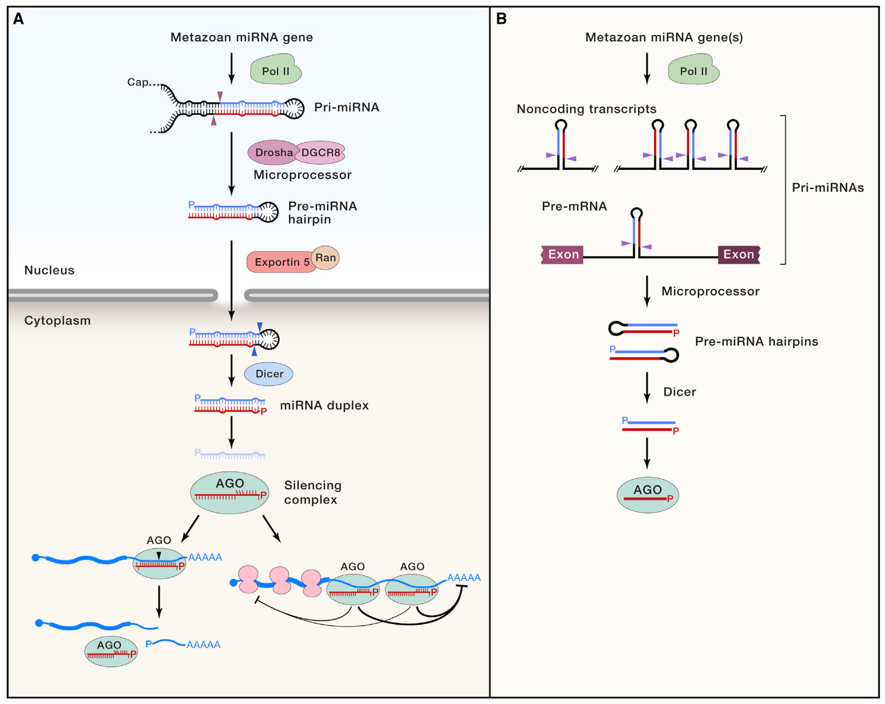
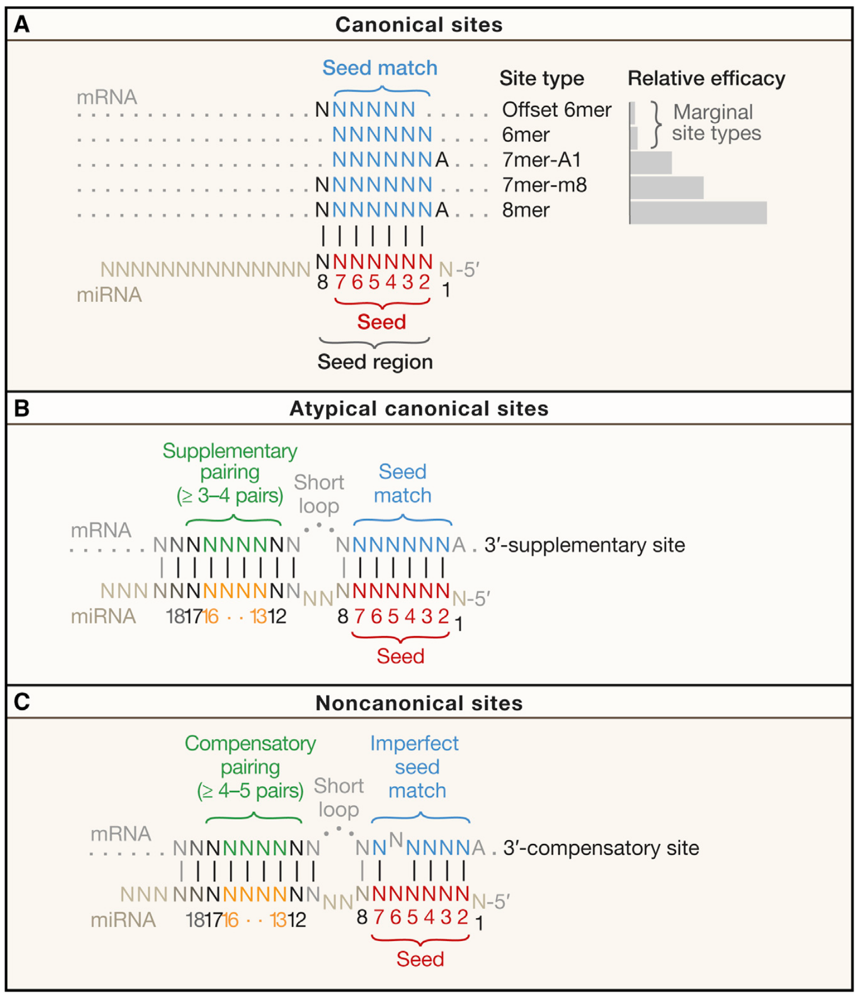
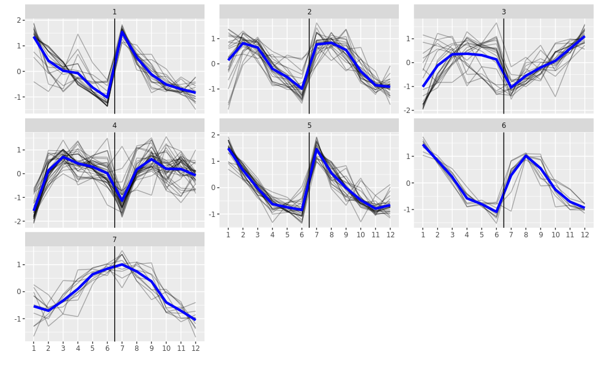

\pagenumbering{gobble} 
\clearpage
\pagenumbering{arabic} 
\tableofcontents
\clearpage

```{r setup, include = FALSE}
knitr::opts_chunk$set(message=FALSE, warning=FALSE,
tidy.opts=list(width.cutoff=60)) 
```

```{r libraries, message=FALSE, warning=FALSE, echo=FALSE}
suppressPackageStartupMessages({
  library(ggplot2)
  library(plgINS)
  library(DT)
  library(viridis)
  library(RColorBrewer)
  library(data.table)
  library(dplyr)
  library(cowplot)
  library(matrixStats)
  library(RUVSeq)
  library(ggrepel)
  library(grid)
  library(ComplexHeatmap)
  library(kableExtra)
})
```

```{r HM1 function, message=FALSE, warning=FALSE, echo=FALSE}
# create heatmap matrix
MHv1 <- function(df, metric="detPPV", form=method+is.bartel~prop, fn=mean, hm=c("1","2"), data.annotate=FALSE, name, ...){
  
  # reshape data
  m <- reshape2::dcast(df, form=form, value.var=metric, na.rm=TRUE, fun.aggregate=fn)
  
  if(hm==1){
    # generate matrix & annotations
    ds <- as.character(m$dataset)
    ds.bartel <- as.character(m$is.bartel)
    names(ds) <- names(ds.bartel) <- rownames(m) <- m[,1]
    m <- m[,-c(1:3)]
    ds2 <- NULL
    splt <- factor(ds.bartel, levels=c("bartel","other"))
    lbl <- colnames(m)
    
  } else if(hm==2){
    # generate matrix & annotations
    l <- split(m, m$is.bartel)
    m <- cbind(l$other[,-2],l$bartel[,-c(1:2)])
    rownames(m) <- m[,1]
    m <- m[,-1]
    ds2 <- factor(c(rep("other",4),rep("bartel",4)), levels=c("other","bartel"))
    splt <- NULL
    lbl <- rep(colnames(m)[1:4],2)
  }
  
  # heatmap
  if(!data.annotate){
    hm <- ComplexHeatmap::Heatmap(m, name=name, cluster_columns=FALSE, 
                                rect_gp=gpar(col="white",lwd =.5),
                                column_split=ds2, row_split=splt,
                                column_title=levels(ds2),
                                column_labels=lbl, 
                                row_gap=unit(2,"mm"), 
                                ...)
    return(hm)
    
    } else {
      hm2 <- ComplexHeatmap::Heatmap(ds, name="dataset", 
                                   col=colors$dataset, 
                                   ...)
      return(hm2)
    }
}
```

```{r HM2 function, message=FALSE, warning=FALSE, echo=FALSE}

# create heatmap matrix
MHv2 <- function(df, metric="TP.atFDR05", form=treatment+dataset+sample+mirexpr~prop, fn=mean, data.annotate=FALSE, name=name, ...){
  
  # reshape data
  m <- reshape2::dcast(df, form=form, value.var=metric, na.rm=TRUE, fun.aggregate=fn)
  
  # allocation
  if(any(grepl("mirexpr",as.character(form)))){
    feature <- "mirexpr"
    lvls <- c("no_mirexpr","mirexpr")
  } else {
    feature <- "exon.specific"
    lvls <- c("unseparated","exonic")
  }
  
  # generate matrix & annotations
  l <- split(m, m[[feature]])
  l <- lapply(l, function(x) aggregate(x[,-c(1:4)], by=list(x[,1],x[,2]), FUN="mean"))
  m <- cbind(l[[lvls[1]]][,-2],l[[lvls[2]]][,-c(1:2)])
  ds <- as.character(l[[lvls[1]]]$Group.2)  
  ds.bartel <- sapply(ds, function(x) if(x=="bartel") "bartel" else "other")
  names(ds) <- names(ds.bartel) <- rownames(m) <- m$Group.1
  m <- m[,-1]
  ds2 <- factor(c(rep(lvls[[1]],4),rep(lvls[[2]],4)), levels=lvls)
  
  if(any(grepl("mirexpr",as.character(form)))){
    ha <- HeatmapAnnotation(mir=ds2, col=colors, annotation_legend_param=list(title=feature),
                          show_annotation_name=FALSE)
  } else {
    ha <- HeatmapAnnotation(ex=ds2, col=colors, annotation_legend_param=list(title=feature),
                          show_annotation_name=FALSE)
  }
  
  # heatmap
  if(!data.annotate){
  hm <- ComplexHeatmap::Heatmap(m, name=name, cluster_columns=FALSE, rect_gp=gpar(col="white",lwd =.5),
                               column_split=ds2, 
                               row_split=factor(ds.bartel, levels=c("bartel","other")),
                               column_labels=rep(colnames(m)[1:4],2), 
                               column_title=metric,
                               row_gap=unit(2,"mm"), column_gap=unit(2,"mm"), 
                               top_annotation=ha, ...)
  return(hm)
  
  } else {
    hm2 <- ComplexHeatmap::Heatmap(ds, name="dataset", col=colors$dataset, ...)
    return(hm2)
  }
}
```

```{r pval function, message=FALSE, warning=FALSE, echo=FALSE}

# function to do lin-reg
getPval <- function(form, df, dset, opt=c("mir","ex")){
  if(!missing(dset)){
    pvals <- summary(lm(form, data=subset(df, dataset==dset), na.action=na.exclude))
  } else {
    pvals <- summary(lm(form, data=df, na.action=na.exclude))
  }
  if(opt=="mir"){
    p <- pvals$coefficients["mirexprmirexpr","Pr(>|t|)"]
  } else {
    p <- pvals$coefficients["exon.specificexonic","Pr(>|t|)"]
  }
  #names(p) <- opt
  if(is.na(p)){
    return(1)
  } else {
    return(p)
  }
}
```

```{r round function, message=FALSE, warning=FALSE, echo=FALSE}

# function to round numeric dataframe columns
doRound <- function(df){
  for(i in 1:ncol(df)){ 
    if(is.numeric(df[,i])){
      df[,i] <- plgINS::dround(df[,i], roundGreaterThan1=TRUE)
      }
    }
  return(df)
}
```

```{r import df, echo=FALSE}

df <- readRDS("../results/combined.benchmark.rds")
e <- readRDS("../../iPSCdiff/enrichMiR/results/longRNA.mirexpr.enrichMiR.rds")
TS <- readRDS("../data/TargetScan_human.rds")
se <- readRDS("../../iPSCdiff/data/Long_RNA/longRNA.DEA.SE.rds")
se.small <- readRDS("../../iPSCdiff/data/Small_RNA/smallRNA_oasis.DEA.SE.rds")

for(i in colnames(rowData(se.small))){
  rowData(se.small)[[i]] <- DataFrame(rowData(se.small)[[i]])
}
```

```{r, echo=FALSE}

# dataframe subsets
df.std <- df[df$mirexpr=="no_mirexpr" & df$exon.specific=="unseparated",]
df.mir <- df[df$mirexpr=="mirexpr" & df$exon.specific=="unseparated",]
df.ex <- df[df$mirexpr=="no_mirexpr" & df$exon.specific=="exonic",]
```

```{r, echo=FALSE}

# color palette dataset
newCols <- colorRampPalette(grDevices::hcl.colors(length(unique(df$dataset)),palette = hcl.pals()[107]))
cols.data <- newCols(length(unique(df$dataset)))
names(cols.data) <- levels(df$dataset)
# color palette method
set.seed(111)
colourCount = length(levels(df$method))
getPalette = colorRampPalette(brewer.pal(9, "Set1")[-6])
cols.method <- structure(sample(getPalette(colourCount)), names=levels(df$method))
# color palette design
cols.design <- structure(cols.method[c(4,5)], names=levels(df$design))
# color palette mirexpr
cols.mir <- structure(cols.design, names=levels(df$mirexpr))
# color palette exon.specific
cols.ex <- structure(cols.design, names=levels(df$exon.specific))

colors <- list(dataset=cols.data, 
               method=cols.method, 
               design=cols.design,
               mir=cols.mir, 
               ex=cols.ex)
```


\LARGE  
miRNA target enrichment benchmark and application to neuronal differentiation identify miRNAs putatively involved in maturation
\vspace{0.3cm}  
\small  
Tomás Germade  
Supervised by: Pierre-Luc Germain, Gerhard Schratt  
Contributions from: Pierre-Luc Germain, Michael Soutschek, Reetu Ramesh Daswani, Helena Caria Martins  
\vspace{1cm}  

\normalsize  
\begin{abstract}  
MiRNAs can regulate a large host of target mRNAs, each member of which in turn can be regulated by many different miRNAs. Due to the complexity and scope of this network it is often difficult to efficiently validate the functional role of miRNAs in different cellular contexts. Computational prediction of miRNA targets has proven invaluable in this undertaking. One of these approaches aims to identify co-regulatory expression patterns in pre-defined sets of putative miRNA targets. Here we examined one such tool called enrichMiR which incorporates a varied set of statistical tests. We performed a systematic benchmark in order to assess the predictive accuracy achieved by these tests and by supplementary procedures. We found that a simple Fisher’s test combined with a tissue-specific list of miRNAs performed best. EnrichMiR was thus applied on a novel Ngn2-mediated neurodifferentiation and maturation dataset and identified two miRNAs (miR-153 and miR-181) implicated in neuronal processes. In a secondary analysis of this dataset, independent of enrichMiR, we discovered  circRNAs that based on their expression patterns might likewise have a role in neuronal maturation.  
\end{abstract}  

\vspace{1cm}  


# Introduction

## miRNAs

The study of larva development in the nematode \emph{Caenorhabditis elegans} resulted in the discovery of two small RNA transcripts of about 22 nt length and capable of gene downregulation. The sequence of those RNAs was found to be complementary to 3'UTR regions of putative targets. Named lin-4 (\cite{lee_c_1993}) and let-7 (\cite{reinhart_21-nucleotide_2000}), these small RNAs constituted the first identified microRNAs (miRNAs) (\cite{bartel_metazoan_2018}).

### Biogenesis  

Canonical miRNA biogenesis involves transcription of a so-called pri-miRNA and two subsequent sequential endonuclease-mediated cleavage events. Each pri-miRNA is composed of a hairpin loop structure that is first cleaved by the Drosha-DGCR8 microprocessor. The resulting ~60 nt long pre-miRNA hairpin is subsequently transported from the nucleus to the cytoplasm by Exportin-5. In the cytoplasm the second cleavage takes place, mediated by the Dicer endonuclease. This releases the loop structure to yield a  mature 21-25 nt miRNA duplex.  
Non-canonical biogenesis on the other hand mostly bypasses Drosha cleavage, as observed in spliceosome-mediated mirtron generation, the formation of endogenous shRNAs and other chimeric variants (\cite{obrien_overview_2018}).  

```{r, out.width="350pt", echo=FALSE, fig.align="center", fig.cap="Schematic of canonical miRNA biosynthesis and inhibitory action in animals. (A) Pri-miRNA are first cleaved inside the nucleus by Drosha-DGCR8. The resulting pre-miRNA hairpins are exported into the cytosol where they are cleaved again by Dicer, giving rise to the mature ~22 nt miRNA duplex. One of the strands gets loaded into AGO where it serves to target mRNAs based on binding affinity. These strands are referred to as guide strands. Subsequent miRNA-mediated suppression of transcripts can either occur through inhibition of the translation machinery and deadenylation induced mRNA decay or through mRNA slicing. The latter case is rare and requires extensive complementary binding. (B) Pri-miRNA can be found in introns of coding genes, in which case the miRNA in question is often co-transcribed with its host gene, as well as non-coding regions of the genome."}

```


### Inhibition 

After being generated, one of the duplex strands strands will be loaded onto an Argonaute (AGO) protein and incorporated into the RNA-induced silencing complex (RISC). Which strand gets loaded depends on the binding affinity of its 5' terminus with the AGO pocket. During the loading process the so-called passenger strand gets expulsed, while the so-called guide strand remains (\cite{schwarz_asymmetry_2003}). Such AGO bound miRNAs were shown to be highly stable (\cite{bail_differential_2010}) (\cite{guo_characterization_2015}), revealing half-lives up to 25 hours in certain cells (\cite{kingston_global_2019}). A notable exception to this was found in neurons which, depending on their activity levels, showed high rates of miRNA decay (\cite{krol_characterizing_2010}). 

MiRNAs bind to mRNAs based on the extent of their sequence complementarity. Depending on the binding affinity, the RISC will induce repression of the mRNA target. This repression can happen in two distinct ways: 1) Extensive sequence complementarity induces slicing of a target (\cite{llave_cleavage_2002}) (\cite{valencia-sanchez_control_2006}). This process is common in plants and siRNA-mediated repression but rare in animals. 2) The RISC prompts the recruitment of deadenylases which destabilize the target and inhibits translation (\cite{wu_micrornas_2006}). An exception to this mode of action has been found in cells under cell cycle arrest, where miRNAs were implicated in target upregulation (\cite{vasudevan_posttranscriptional_2012}). 

### Binding 

In animals, miRNA binding to target sites involves the so-called miRNA seed sequence, situated in nucleotides 2-7 of its 5' region. This sequence is often extended to nucleotides 2-8. Canonical binding involves either partial or complete pairing of a miRNA seed region to complementary sites on a mRNA target. Functional pairings comprise 8mer, 7mer and 6mer sites, in decreasing order of binding affinity and repression efficiency. Each of these site types features subtypes depending on small variances or additions (\cite{bartel_metazoan_2018}). One example involves the presence of an Adenine (A) on the site across position 1 of the miRNA (at the 5' terminus) (\cite{lewis_conserved_2005}). This configuration was found to enhance binding affinities regardless of the specific miRNAs involved. The reason was found to be its binding to AGO (\cite{ma_structural_2005}) (\cite{schirle_water-mediated_nodate}). A second example represents an additional pairing of nucleotides 13-16 in the 3' region of certain miRNAs. This resulted in relatively weak supplementary binding (\cite{grimson_microrna_2007}) that makes it possible for some miRNAs-mRNA pairs to functionally interact despite seed mismatches (\cite{mcgeary_biochemical_2018}).  
Because of this strong functional dependency on seed-pairing, different miRNA variants sharing the same seed sequence show similar target interaction and are thus are classified as miRNA families. These families don't necessarily share common ancestry but it is thought that they often do (\cite{bartel_metazoan_2018}).  

While plant miRNAs tend to bind to the coding region (CDR) of their mRNA targets, in animals most functional binding sites have been identified in 3'UTR regions (\cite{millar_plant_2005}). This being said, many functional interactions have been found in 5'UTR and CDR regions in both flies and different vertebrates (\cite{stark_discovery_2007}) (\cite{schnall-levin_conserved_2010}) (\cite{lewis_conserved_2005}Lewis, 2005) (\cite{agarwal_predicting_2015}Agarwal, 2015). A somewhat special case involves so-called miRNA recognition elements (MREs), binding sites exclusive to CDRs bound by extensive 3' base pairing (\cite{zhang_novel_2018}). 


```{r, out.width="250pt", echo=FALSE, fig.align="center", fig.cap="Different functional miRNA-mRNA interactions can be categorized depending on their degree of sequence complementarity and repression strength. (A) Canonical miRNA binding sites involve the so-called seed region at the 5’ terminus of a miRNA. It has been found that nucleotides adjacent to the seed can similarly affect binding. An A opposite the first miRNA nucleotide has been shown to interact with the AGO component itself. Usually, the stronger the binding between the transcripts the higher the suppression efficiency. We are thus able to rank the different binding types as follows: 8mer > 7mer-m8 > 7mer-A1 > 6mer > Offset 6mer. (B) It has been discovered that a short region in the 3’ terminus of the miRNA can contribute to the binding. (C) These effects are usually weak but can in some cases enable a discernible functional effect of miRNAs with imperfect seed matching."}

```


### Repression dynamics  

The strength of gene suppression conducted by a single microRNA is moderate (\cite{baek_impact_2008}). Yet miRNAs have been described to experience a switch-like change in repression efficiency depending on relative target abundances. High repression occurs at low target levels and vice versa (\cite{arvey_target_2010}). The sharpness of such a switch in repression efficiency depends on both interaction strength and relative abundances (\cite{mukherji_micrornas_2011}). The introduction of sponges, able to sequester and silence miRNAs, of either exogenous (\cite{ebert_microrna_2007}) or endogenous origin (\cite{hansen_natural_2013}), as well as potential compartmentalization can further re-calibrate the ratio of active miRNA and respective targets.  

Combined suppression of mRNAs by multiple miRNAs was found to affect suppression strength. Depending on the distance between binding sites, repression can be competitive or cooperative and thus excel individual effects (\cite{doench_specificity_2004}) (\cite{grimson_microrna_2007}). The same additive repression capabilities have been observed for binding sites outside the 3'UTR in flies (\cite{schnall-levin_conserved_2010}).  


### Experimental investigation

The verification of these complex interactions and confirmation of their regulatory action can be addressed with experimental means. Direct miRNA-mRNA interaction may be studied using techniques such as AGO-Clip (Argonaute-crosslinking and immunoprecipitation) (\cite{chi_ago_2009}) (\cite{grosswendt_unambiguous_2014}) and CLASH (crosslinking, ligation, and sequencing of hybrids) (\cite{kudla_cross-linking_2011}). The effects of a miRNA on its targets may be studied using luciferase reporter assays (\cite{nicolas_experimental_2011}) or RNA-seq after perturbation of miRNA levels, e.g. via knock-out, overexpression or antagomirs. Any evidence produced by the latter may be corroborated by the system's reversion to an original state upon neutralizing the perturbation, e.g. by a rescue or the manipulation of UTR binding sites via the introduction of mutations, knock-out and overexpression. Such experimental methods are resource- and time-intensive and therefore not ideal for large-scale investigations.  


## Target prediction  

A way to overcome these limitations, are bioinformatic predictions to narrow experimental queries to fewer candidates. This can be achieved by scanning miRNAs and mRNAs for features that have previously been experimentally associated with functional effects, such as: seed sequence complementarity, binding thermodynamics, UTR accessibility, target site conservation and target site abundance, just to name a few.  
Another possibility is to train Machine Learning (ML) algorithms on datasets harbouring experimentally confirmed miRNA-mRNA relationships. This can be done either in a supervised fashion, when combined with a pre-defined feature selection as listed above, or unsupervised fashion, when features are discovered independently, based on raw data. The latter can also be used for the discovery of features that can then be applied to supervised methods (\cite{grimson_microrna_2007}) (\cite{agarwal_predicting_2015}). Depending on the quality and quantity of training datasets such methods have been shown to excel the predictive power of some experimental approaches (\cite{agarwal_predicting_2015}). In order for such ML methods to extrapolate generalizable patterns, specific feature combinations need to be sufficiently abundant in their respective training datasets.  
There have also been cases where results based on multiple differing approaches have been combined in order to increase overall prediction inference (\cite{oliveira_combining_2017}). For an up-to-date review on different machine learning strategies as well as existing target prediction tools and databases see \cite{schafer_prediction_2020}. 

### TargetScan  

One example of a miRNA binding site prediction tool is TargetScan (current version: 7.2). This tool was first published in 2003 (\cite{lewis_prediction_2003}) and received its last major update in 2015 (\cite{agarwal_predicting_2015}).  
TargetScan is an example for the initial application of an unsupervised ML algorithm to select features. These are subsequently applied to train a supervised ML algorithm in order to generate a predictive model. The selected features were partly based on features derived from predecessor models and partly based on features identified by combined step-wise linear regression and successive Akaike Information Criterion (AIC) evaluation. The training data constituted 74 microarrays of single-miRNA HeLa cell transfections. The resulting model is composed of 14 features, including minimum distance from 3'UTR ends, local AU composition, 3' supplementary pairing, predicted seed-pairing stability, target-site abundance, 3'UTR length, ORF length, predicted structural accessibility, the number of offset-6mer sites in the 3'UTR and 8mer sites in the ORF, the nucleotide identity of position 8 of the target, the nucleotide identity of positions 1 and 8 of the miRNA, and site conservation. No interaction terms between given features was allowed, in order to limit model complexity.   Additionally, based on findings that indicate unsignificant repression of non-canonical binding sites, only 3'UTR seed-pairing was considered (\cite{agarwal_predicting_2015}). Binding site predictions were verified using various test datasets. TargetScan was able to outperform all other established tools at the time (\cite{agarwal_predicting_2015}). Lately, methods such as MiRTarget (v4.0) (\cite{liu_understanding_2019}), deepTarget (\cite{lee_deeptarget_2016}) and a biochemical model generated by McGeary et al. \cite{mcgeary_biochemical_2019} based on dissociation rates ($K_{D}$) as well as approaches that combine various tools were able to outperform TargetScan in terms of explained dataset variance (\cite{schafer_prediction_2020}).

### Target enrichment tools  

A different approach for the identification of actively regulating miRNA candidates is employed by miRNA target enrichment tools. Based on mRNA expression profiles and pre-defined miRNA target annotations, various statistical tests can be applied to detect co-regulatory patterns in target sets. This serves to identify miRNAs possibly involved in the formation of such patterns. Several methods have been implemented in the past, each of them implementing different types of analysis.  

FAME constructs biparite graphs where miRNAs and targets are separated into different sets and are connected via edges that represent TargetScan-derived context scores. It then  generates random degree-preserving permutations of that graph to assess how likely it is that the topology found in the initial network is inherent in the network structure (\cite{ulitsky_towards_2010}). miTEA employs a so-called mmHG statistic that assesses similarity between the top of two ranked lists, e.g. targets of a given miRNA and a list of genes representing an expression profile. Subsequently, the likelihood of the observed element densities at their positions is calculated, assuming random distribution (\cite{steinfeld_mirna_2013}). Other tools involve tests such as gene set enrichment analysis (GSEA) and over-representation analysis (ORA) (\cite{backes_mieaa_2016}),  hypergeometric tests (\cite{fan_mirnet_2016-1}) (\cite{van_dongen_detecting_2008}) (\cite{vlachos_diana-mirextra_2016}) and hierarchical gene co-expression signature enrichments (\cite{gu_inferring_2013}). There is currently no clear consensus as to the best way of implementing enrichment statistics.


## Project scope  

In this project we implemented an in-house miRNA target enrichment tool called enrichMiR. It incorporates various statistical tests in order to examine a possible co-regulation of miRNA target sets in differentially expressed mRNA profiles. To evaluate the inference accuracy of the different tests and input options, we conducted a systematic benchmark on 5 datasets constituting 33 miRNA perturbation experiments. A simple Fisher's test was found to perform best, demonstrating consistently high metric scores. Moreover, tissue-specific restriction of miRNA resulted in an additional improvement. Having selected the most beneficial measures, we applied enrichMiR on a novel Ngn2-mediated neurodifferentiation and maturation dataset generated in our lab. We were thus able to identify several miRNA candidates, two of which (miR-153 and miR-181) were confirmed to be involved in neuronal processes.  
Further investigation of transcriptional dynamics in the Ngn2 neurodifferentiation dataset resulted in the identification of a set of circRNAs possibly implicated in neuronal development. 


# Results


## A novel tool for miRNA target enrichment analysis  

Our aim was to examine transcriptome profiles in order to discover miRNAs whose regulatory function could impact neuronal development in humans. For this purpose, we chose to utilize an in-house computational tool named enrichMiR. EnrichMiR has the capability to run various statistical tests on differential mRNA expression signatures to infer miRNAs that either 1) cause said differential signatures or 2) would be capable of doing so. To achieve this, enrichMiR depends on the input of several objects: a differential mRNA expression profile, a pre-defined library of individual miRNAs and their putative targets, and optionally a species-specific list of expressed miRNAs. The statistical methods incorporated into enrichMiR at the time of this report range from Fisher's tests over cumulative distribution tests to linear regressions, each of them composed of diverse implementations. Their particular choice and procedural implementation predated the current project and will not be discussed in depth here. Nevertheless, a brief overview can be found in Tables 2 and 3, where each test is defined by the inputs it requires as well as a brief description of the underlying approach. The information a given test extracts from a supplied DEA is either binary (up- or downregulation) or continuous (differential expressions). The information extracted from the miRNA target annotation can either entail binary target gene sets, non-binary binding site numbers or TS derived context scores.   


\small  
 
|  | Experimental design | Organism | Celltypes | Nr. of experiments | Nr. of DE genes | Perturbation time [d] |
|-|-|-|-|-:|-:|-:|
| Bartel | TF | Human | HeLa | 16 | 1629 (193) | 1 |
|  |  |  | HEK293 | 12 | 482 (101) | 1  |
| Rat | TF | Rat | hippocampal neurons/glia | 2 | 21 (0) | 5 |
| Jeong | KO | Human | SNU-638 | 1 | 6473 (277) | several |
| Amin | KO | Mouse | CAD | 1 | 3741 (297) | 4 (E12.5) |
| Cherone | KO | Mouse | iN | 1 | 7726 (1561) | 0 |
|  |  |  |  |  | 5525 (1003) | 1 |
 
Table: The benchmarking datasets have been selected to harbour both upregulated (transfection, TF) and downregulated (knock-out, KO) effects. Each of them derives from a different tissue. The Bartel datasets contribute the largest number of experiments. The Number of DE (differentially expressed) genes contains the numbers of both unseparated and exon-specific profiles (in brackets). We applied a threshold of FDR < 0.05. More details on each of the datasets and DEAs can be found under Materials & Methods.

\normalsize  


## A benchmark of the various miRNA target enrichment tests  

To test the prediction accuracy of each statistical analysis method, we chose to conduct a systematic benchmark based on datasets with known miRNA perturbations. We assessed if we could successfully predict the correct affected miRNA family  and which method produced the most accurate prediction. In addition, we tested two measures that could potentially increase inference accuracy of each method. First, enrichMiR can optionally be supplied with a tissue-specific miRNA expression profile in order to restrict the otherwise species-specific set of miRNAs to be tested. Secondly, we supplied each method with differential expression (DE) profiles specific to reads from processed transcripts which aren't visible in intronic/unspliced reads. This, so we argued, would partially filter out the downstream cellular response to miRNA perturbation and allow for the direct effect of miRNAs to be more distinct (\cite{zeisel_coupled_2011}) (\cite{gaidatzis_analysis_2015}) (see [Materials & Methods](#exon-specific-dea)).  
Based on the performance of the methods, we created three different combinations, each comprised of three individual methods. They were generated by p-value aggregation, once using the Fisher and once the geometric mean approach. They are included in the following benchmark.
 


\small  


| Test       | Signal type | Annotation input | Description                                                          |
|------------|-------------|------------------|----------------------------------------------------------------------|
| EN         | set         | genesets         | ORA of target genes among set (e.g. downregulated)                   |
| wEN        | set         | nb sites         | ORA of binding sites corrected for UTR length                        |
| michael    | set         | nb sites         | ORA of binding sites                                                 |
| regmir     | set         | scores           | Regularized constrained logistic regression on scores                |
| regmirb    | set         | genesets         | Regularized constrained logistic regression (binary)                 |
| aREAmir    | continuous  | scores           | Score-weighted analytic rank enrichment analysis on signed log-FDRs  |
| aREAmir2   | continuous  | scores           | Modification of aREAmir correcting for pleiotropy                    |
| modScores  | continuous  | scores           | Linear regression of logFCs on target prediction  scores             |
| modSites   | continuous  | nb sites         | Linear regression of logFCs on number of binding sites               |
| KS         | continuous  | genesets         | Kolmogorov-Smirnov test on logFCs                                    |
| KS2        | continuous  | genesets         | Modification of KS-test                                              |
| MW         | continuous  | genesets         | Mann-Whitney / Wilcoxon test on logFCs                               |
| GSEA       | continuous  | genesets         | Gene set enrichment analysis (permutation test)                      |

Table: Individual statistical tests contained in enrichMiR. They were measured against each other in our benchmark. Signal type refers to how DEA results are incorporated into the respective tests: ‘set’ signifies a binomial variable (either up-/downregulated or not) while ‘continuous’ signifies the incorporation of expression data. Annotation input refers to the information that is utilized from the supplied list annotation: ‘genesets’ means that transcripts with at least 1 putative binding site are considered, ‘nb sites’ stands for non-binary sites, meaning that each binding site is considered individually and ‘scores’ refers to the context scores e.g. provided by TargetScan. 


| Test | Combination | Aggregation method |
|-|-|-|
| combFish.1 | michael, wEN and modScore | Fisher |
| combGeom.1 | michael, wEN and modScore | Geometric mean |
| combFish.2 | michael, aREAmir and KS2 | Fisher |
| combGeom.2 | michael, aREAmir and KS2 | Geometric mean |
| combFish.3 | michael, aREAmir and regmirb | Fisher |
| combGeom.3 | michael, aREAmir and regmirb | Geometric mean |

Table: Based on the initial performances of individual tests we aggregated them into combined tests.

\normalsize  

We selected five datasets, derived from different organisms and tissues, and including a total of 33 miRNA perturbations, have been selected to serve as benchmark datasets based on their single-miRNA perturbation design. For the purpose of simplification, we refer to the different datasets as *Bartel*, *Rat*, *Jeong*, *Amin* and *Cherone* based on the authors of their respective publications. A more detailed summary of each dataset can be found in Table 1 and the [Materials & Methods](#benchmark-datasets) section.  

EnrichMiR analysis depends on the supplementation of a list linking miRNA families (ie. miRNA sharing the same seed sequences) to their putative targets. The annotation we used for this purpose was acquired from TargetScan (TS) (see [Materials & Methods](#mirna-target-annotations)), although the supplementation of alternative target annotations is equally serviceable. Individual miRNA targets were recorded on a per gene level. We further restricted annotations to include predicted 8mer and 7mer binding sites. With the aim of introducing varied degrees of noise to the datasets, we performed multiple enrichMiR runs per experiment, each supplied with a differently permuted TS annotation. For each experiment, the random permutations were limited to the set of target genes assigned to the perturbed miRNA particular to that experiment. Also, the randomly selected target genes were exchanged for non-target genes of the same annotation. The permutation percentages we chose were 0 (original), 20, 35 and 50. Each permutation was replicated 3 times. For instance, a miR-7 duplex transfection experiment derived from the Bartel dataset underwent 10 enrichMiR runs: once with the original annotation and three times each for the three different permutation degrees. Each permutation randomly exchanged miR-7 target genes with non-miR-7 target genes.  

To assess the relative performance of each statistical analysis method integrated in enrichMiR, we used four different scoring metrics. Each of them depends on the definition of a true miRNA family (or seed sequence). Detailed information on true miRNA family assignments can be found under [Materials & Methods](#assignment-of-true-mirna-families). The first two scores are True-Positive (TP) and False-Positive (FP) numbers at FDR < 0.05. Since we only ever assigned one single true miRNA family per sample, the TP numbers coincide with the TP rate (TPR) per sample. For the same reason, we could use the number of FP directly as it is tightly linked to the false discovery rate ($FDR=FP/(TP+FP)$). The third score we termed detPPV (positive predictive value at detection level). It reflects the relative FDR based rank of the true to non-true miRNA families. Its maximum value is 1 (when the true family achieves the highest rank) and decreases with the number of non-true families that surpass the true family in rank. The detPPV score is useful in that it can highlight methods which produce good ranking of families but poorly calibrated estimates of significance. The fourth score was termed log10QDiff and conveys the $-log10(FDR)$ differences between the true family and the highest ranking non-true family, where the rankings again are based off of FDR values. This term can be negative if a non-true family achieves a higher rank than the true family.  

## Most tests appear relatively robust to ample noise in the annotation

The enrichMiR results for each experiment across the different permutation levels of the TS annotation (0, 20, 25 and 50 %) revealed a high robustness to noise. Across all statistical tests, detPPV scores displayed larger variance across the experiments than within, i.e. across their permutation percentages. Figure 3 shows a heatmap of the mean detPPV values across all analysis methods subdivided into the different TS permutations. None of the methods detected the true miRNA family when applied to experiments pertaining to the *Jeong* and *Cherone* datasets, as deducible from Figures 3, 5 and 6, each highlighting different scores.  


```{r FIGURE_HM1, message=FALSE, warning=FALSE, fig.dim=c(4,4), echo=FALSE, fig.align="center", fig.cap="Heatmap of detPPV scores across experiments and miRNA target list permutations. One of the scores we used to evaluate the performance of the enrichMiR tests we called detPPV. This score represents the relative rank of the true miRNA family relative to non-true families. Its values range from 0 to 1. With few exceptions the enrichMiR scores for each sample either slightly decreased with each level of permutation or stayed constant. The score differences between the treatments were more striking, revealing their degree of difficulty regarding enrichMiR analysis. In the Jeong and Cherone datasets detection of the true family largely failed.  "}

# generate color gradient for TP
hm.col <- circlize::colorRamp2(c(.2,.7,1),c("#043495","#f4da71","#bd0f0f"), space="RGB")
# generate heatmaps
hm1 <- MHv1(df.std, name="detPPV", form=treatment+dataset+is.bartel~prop,
            hm=1, show_row_dend=FALSE, col=hm.col,
            column_title_gp=gpar(fontsize=11),
            row_title_gp = gpar(fontsize = 11),
            column_names_gp=gpar(fontsize = 9),
            row_names_gp=gpar(fontsize = 9)
            )
hm2 <- MHv1(df.std, data.annotate=TRUE, form=treatment+dataset+is.bartel~prop,
            hm=1, show_row_names=TRUE, width = unit(5, "mm"),
            column_title_gp=gpar(fontsize=11),
            row_title_gp = gpar(fontsize = 11),
            column_names_gp=gpar(fontsize = 9),
            row_names_gp=gpar(fontsize = 8)
            )
# plot
draw(hm1 + hm2, ht_gap = unit(.2, "cm"), show_row_dend=FALSE)
```


High robustness to noise introduced by TS permutation was also observable across the statistical methods. Here again, score variances were higher across methods than permutations. Figure 4 gives an idea of the detPPV behaviours of each applied enrichMiR method when separated into scores derived from *Bartel* and all other datasets.  


```{r FIGURE_HM2, message=FALSE, warning=FALSE, fig.dim=c(5,4), echo=FALSE, fig.align="center", fig.cap="Heatmap of detPPV scores across methods and miRNA target list permutations. The samples are split up according to their membership to either Bartel or other datasets. The displayed scores are mean detPPV values across samples. In all cases except for regmir the performance of enrichMiR analysis methods was higher for samples stemming from Bartel. In all but a few cases the scores either gradually declined or remained constant with increased degrees of miRNA target list permutation (x-axis). See Tables 1 and 2 for summaries of the enrichMiR methods."}

# generate color gradient for TP
hm.col <- circlize::colorRamp2(c(0.2,.6,1),c("#043495","#f4da71","#bd0f0f"), space="RGB")
# generate heatmaps
hm1 <- MHv1(df.std, metric="detPPV", name="detPPV", hm=2,
            show_row_dend=FALSE, col=hm.col, column_gap=unit(2,"mm"),
            column_title_gp=gpar(fontsize=11),
            row_title_gp = gpar(fontsize = 11),
            column_names_gp=gpar(fontsize = 9),
            row_names_gp=gpar(fontsize = 9)
            )
hm1
```


## A simple Fisher-based method performs best  

Methods such as *wEN*, *EN*, *combFish.1*, *combGeom.1* and *michael* showed high detPPV scores, reflecting consistently high true miRNA family rankings. All of them except for *michael* simultaneously displayed high numbers of FP results relative to other methods. Even though these methods were highly sensitive they were also relatively unspecific. The *michael* method on the other hand proved to be both sensitive and specific: the number of reported FP miRNA families was relatively low while true miRNA family detection consistently high. In the *Jeong* dataset it was the only method to ever detect the the correct miRNA family, partially doing so even with the introduction of additional noise. Figure 5 displays the TPR and FP results for each method subdivided into the different datasets. Here, the combined methods 2 and 3 (*combFish* & *combGeom*) as well as *KS2* tended to achieve relatively high sensitivity and specificity with the latter being affected by the noise introduction to a relatively high degree.  


```{r, message=FALSE, warning=FALSE, echo=FALSE}

# FP-TP plot (at FDR .05)

## get average number of FP & TP at FDR .05 for each combination of permutation & method & mirexpr
df.agg <- aggregate(df.std[,c("FP.atFDR05","TP.atFDR05")], by=df.std[,c("prop","method","dataset","sample","design")], FUN=mean)
df.agg$dataset <- as.character(df.agg$dataset)
df.agg$dataset[df.agg$sample=="bartel.hela"] <- as.character(df.agg$sample[df.agg$sample=="bartel.hela"])
df.agg$dataset[df.agg$sample=="bartel.hek"] <- as.character(df.agg$sample[df.agg$sample=="bartel.hek"])
df.agg$dataset <- factor(df.agg$dataset)
df.agg <- aggregate(df.agg[,c("FP.atFDR05","TP.atFDR05")], by=df.agg[,c("prop","method","dataset","design")], FUN=mean)
```


```{r FIGURE_TP_FP_std, message=FALSE, warning=FALSE, fig.dim=c(8,6), echo=FALSE, fig.align="center", fig.cap="Comparing False-Positive (FP) and True-Positive (TP) discoveries for each enrichMiR method by their experimental design. The different shapes of the datapoints reflect the mean values achieved under the different levels of miRNA target list permutation we performed. True family detection failed for all tests in both the Cherone and the Jeong datasets, with a notable exception being the michael method."}

set.seed(123)
ggplot(df.agg, aes(x=FP.atFDR05, y=TP.atFDR05, color=method, shape=prop, group=method)) + 
  geom_line() + 
  #guides(color=FALSE) +
  geom_point(size=2.5) + 
  geom_label_repel(data=subset(df.agg, method %in% c("wEN","EN","michael",
                                                          "regmir","KS2","combGeom.3",
                                                          "aREAmir")) 
                   %>% filter(prop=="original"), 
                  aes(label=method), 
                  force=20, 
                  size=2.8,
                  ylim=c(.05,.95), xlim=c(1,15),
                  segment.color="black",
                  segment.alpha=.2, 
                  arrow=arrow(length = unit(0,"npc"), type = "open", ends = "last"),
                  box.padding = unit(.55, "lines"),
                  point.padding = unit(.45, 'lines'),
                  nudge_y=-.2, nudge_x=3
                  ) +
  geom_point() +
  scale_color_manual(values = colors$method) +
  facet_wrap(design~dataset) + 
  scale_x_sqrt() +
  theme_cowplot() +
  theme(panel.border=element_rect(colour = "grey35", fill = NA),
        panel.grid.major=element_line(colour = "grey85"), 
        axis.line=element_blank(),
        strip.background=element_rect(colour = "grey35"),
        axis.ticks=element_line(colour = "grey35"),
        text = element_text(size=10), axis.text = element_text(size=9)
        )
```


The differences between the FDR values assigned to the true miRNA family and the highest ranking non-true miRNA family can be observed in Figure 6. Small differences were obtained from *Jeong*, *Cherone* and *Rat* datasets. In the *Bartel* and *Amin* datasets the *combFish* methods achieved high scores, together with the *EN*, *wEN* and *modScore* methods. The only method that consistently produced negative log10QDiff scores was *regmir*, meaning that it rarely ranked the true miRNA family at the highest position.


```{r FIGURE_BOX_std, message=FALSE, warning=FALSE, fig.dim=c(8,5.5), echo=FALSE, fig.align="center", fig.cap="Comparison of log10QDiff scores between the different enrichMiR methods for each dataset. The log10QDiff score represents the distance between the true miRNA family and the highest ranking non-true  family in terms of FDR value. The Cherone and Jeong datasets again didn’t perform well, with many FDR values being equal to 1. The Rat dataset showed similarly low distances while still achieving high true family discovery rates (see Figure 5). In all other datasets the highest log10QDiff scores were recorded among the combined methods, in particular the ones combined using the Fisher method."}

df.std2 <- df.std
df.std2$dataset <- as.character(df.std2$dataset)
df.std2$dataset[df.std2$sample=="bartel.hela"] <- as.character(df.std2$sample[df.std2$sample=="bartel.hela"])
df.std2$dataset[df.std2$sample=="bartel.hek"] <- as.character(df.std2$sample[df.std2$sample=="bartel.hek"])
df.std2$dataset <- factor(df.std2$dataset)

# Score distributions: box (method)
ggplot(df.std2, aes(x=method, y=log10QDiff, fill=method)) + geom_boxplot() +
  guides(fill=FALSE) + ylab("log10QDiff") + coord_flip() + scale_x_discrete(limits = rev(levels(df$method))) +
  facet_wrap(design~dataset) + geom_hline(yintercept = 0, linetype = "dotted", size = .5) +
  scale_fill_manual(values = colors$method) +
  theme_cowplot() + 
  theme(axis.line=element_line(colour = "grey35"), 
        axis.ticks=element_line(colour = "grey35"),
        strip.background=element_rect(colour = "grey35"),
        text = element_text(size=10), axis.text = element_text(size=9)
        )
```


## Tissue-specific restriction of miRNAs improves inferences  


```{r mir stats, message=FALSE, warning=FALSE, echo=FALSE}

# Score distributions: box (method)
df.mir2 <- df[df$exon.specific=="unseparated" & df$dataset!="jeong",]
df.mir2$log10QDiff[is.infinite(df.mir2$log10QDiff)] <- NA
df.mir2$mirexpr <- relevel(droplevels(df.mir2$mirexpr), ref="no_mirexpr")

df.mir2$dataset <- as.character(df.mir2$dataset)
df.mir2$dataset[grepl("bartel.hela",df.mir2$sample)] <- as.character(df.mir2$sample[df.mir2$sample=="bartel.hela"])
df.mir2$dataset[grepl("bartel.hek",df.mir2$sample)] <- as.character(df.mir2$sample[df.mir2$sample=="bartel.hek"])
df.mir2$dataset <- factor(df.mir2$dataset)

# get pvalues overall
p.values.TP.all.mir <- getPval(form=TP.atFDR05 ~ method + dataset + mirexpr, df=df.mir2, opt="mir")
p.values.FP.all.mir <- getPval(form=FP.atFDR05 ~ method + dataset + mirexpr, df=df.mir2, opt="mir")

# get pvalues per dataset
p.values.TP.mir <- sapply(as.character(unique(df.mir2$dataset)), getPval, form=TP.atFDR05 ~ method + mirexpr, df=df.mir2, opt="mir")
p.values.FP.mir <- sapply(as.character(unique(df.mir2$dataset)), getPval, form=FP.atFDR05 ~ method + mirexpr, df=df.mir2, opt="mir")
```
  
  
Apart from comparing the scores between the different statistical tests we also set out to investigate the impact of restricting the set of miRNAs for which target enrichment should be considered. We ran all enrichMiR analyses once without restriction, in which case we supplied an extensive TargetScan-derived collection of species-specific (but not tissue-specific) miRNA, and once with restriction, in which case we supplied a list of miRNAs expressed in each respective tissue. The origin of these resources is described in the [Materials & Methods](#tissue-specific-mirna-expression-profiles) section. For this test the *Jeong* dataset was excluded due to the lack of tissue-specific miRNA expression data.   
Application of tissue-specific miRNA profiles improved the scores (see Figure 7). The TPR was increased significantly (p-value of `r formatC(p.values.TP.all.mir, format = "e", digits = 1)`) and the number of FPs reduced highly significantly (p-value of `r formatC(p.values.FP.all.mir, format = "e", digits = 1)`) over all datasets. When examining TPR scores for each dataset separately, we found no significant effect for datasets *Rat* (p-value of `r round(p.values.TP.mir["rat"],1)`), *Amin* (p-value of `r round(p.values.TP.mir["amin"],1)`) and *Cherone* (p-value of `r round(p.values.TP.mir["cherone"],1)`). The same analysis for FP scores revealed a highly significant effect for all datasets except *Rat* (p-value of `r round(p.values.FP.mir["rat"],1)`) (see Figure 14). The effect of this measure on a per sample basis and resolved by permutation level is illustrated in Figure 7.   
  

```{r, message=FALSE, warning=FALSE, echo=FALSE}
# take subset
df.sub <- df[df$exon.specific=="unseparated" & df$dataset!="jeong",]
# generate color gradient for TP
hm.col1 <- circlize::colorRamp2(c(0.2,.6,1),c("#043495","#f4da71","#bd0f0f"), space="RGB")
hm.col2 <- circlize::colorRamp2(seq(5,50,length=3),c("#043495","white","#bd0f0f"), space="RGB")
# generate heatmaps
hm1 <- MHv2(df.sub, col=hm.col1, name="TP rate",
            column_title_gp=gpar(fontsize=12),
            row_title_gp = gpar(fontsize=12),
            column_names_gp=gpar(fontsize=9),
            row_names_gp=gpar(fontsize=9)
            )
hm2 <- MHv2(df.sub, metric="FP.atFDR05", col=hm.col2, name="FP rate",
            column_title_gp=gpar(fontsize=12),
            row_title_gp = gpar(fontsize=12),
            column_names_gp=gpar(fontsize=9),
            row_names_gp=gpar(fontsize=9)
            )
hm3 <- MHv2(df.sub, data.annotate=TRUE, show_row_names=TRUE, width = unit(5, "mm"),
            column_title_gp=gpar(fontsize=12),
            row_title_gp = gpar(fontsize=12),
            column_names_gp=gpar(fontsize=9),
            row_names_gp=gpar(fontsize=9)
            )
```


```{r FIGURE_HM3, message=FALSE, warning=FALSE, fig.dim=c(8,5), echo=FALSE, fig.align="center", fig.cap="Heatmaps showing the difference of True-Positive rate (TPR) and False-Positives (FPs) across treatments with and without supplementation of miRNA expression (mirexpr) profiles to enrichMiR. In all cases we either saw an increase in TPR or no change at all when comparing enrichMiR analyses performed without and with mirexpr profiles. The same comparison revealed large decreases in FPs in an overwhelming majority of cases. Both, increases in TPR and decreases in FPs were significant."}
# plot
draw(hm1 + hm2 + hm3, ht_gap = unit(c(.5,.2), "cm"), show_row_dend=FALSE)
```


## Exon-specific DEA inputs increase test specificity and decrease sensitivity

```{r exo stats, message=FALSE, warning=FALSE, echo=FALSE}

# Score distributions: box (method)
df.ex2 <- df[df$mirexpr=="no_mirexpr",]
df.ex2$log10QDiff[is.infinite(df.ex2$log10QDiff)] <- NA
df.ex2$exon.specific <- relevel(droplevels(df.ex2$exon.specific), ref="unseparated")

df.ex2$dataset <- as.character(df.ex2$dataset)
df.ex2$dataset[grepl("bartel.hela",df.ex2$sample)] <- as.character(df.ex2$sample[df.ex2$sample=="bartel.hela"])
df.ex2$dataset[grepl("bartel.hek",df.ex2$sample)] <- as.character(df.ex2$sample[df.ex2$sample=="bartel.hek"])
df.ex2$dataset <- factor(df.ex2$dataset)

# get pvalues overall
p.values.TP.all.ex <- getPval(form=TP.atFDR05 ~ method + dataset + exon.specific, df=df.ex2, opt="ex")
p.values.FP.all.ex <- getPval(form=FP.atFDR05 ~ method + dataset + exon.specific, df=df.ex2, opt="ex")

# get pvalues per dataset
p.values.TP.ex <- sapply(as.character(unique(df.ex2$dataset)), getPval, form=TP.atFDR05 ~ method + exon.specific, df=df.ex2, opt="ex")
p.values.FP.ex <- sapply(as.character(unique(df.ex2$dataset)), getPval, form=FP.atFDR05 ~ method + exon.specific, df=df.ex2, opt="ex")
```


In a next step, we aimed to investigate the effect of running enrichMiR on exon-specific mRNA DEA profiles. The reasoning for this was to partly filter out indirect miRNA perturbation effects inside the cell such as compensatory regulation of mRNA transcription. We would thus exclude the differential effects on unspliced immature transcripts and focus on mature mRNA instead (see [Materials & Methods](#exon-specific-dea)).  
Substitution of unseparated DE profiles with exonic transcript-derived profiles resulted in a highly significant decrease in both TPR (p-value of `r formatC(p.values.TP.all.ex, format = "e", digits = 1)`) and FP (p-value of `r formatC(p.values.FP.all.ex, format = "e", digits = 1)`). Separate examination per dataset revealed a significant decrease in TPR for all datasets except *Jeong* (p-value of `r round(p.values.TP.ex["jeong"],1)`) and *Cherone* (p-value of `r round(p.values.TP.ex["cherone"],1)`). The same analysis for FP scores revealed a highly significant decrease for all datasets (see Figure 15). The effect of DE profile substitution on a per sample basis and resolved by permutation level is illustrated in Figure 9.  


```{r FIGURE_TP_FP_exonic, message=FALSE, message=FALSE, warning=FALSE, fig.dim=c(8,9), echo=FALSE, fig.align="center", fig.cap="Comparison of FPs and TPR for each enrichMiR method by dataset and exon specificity of DEA profiles. The datapoints represent score means across TS permutations. Across all datasets the TP rates achieved by the individual methods significantly decreased. Notable exceptions could be seen in the Amin dataset where regmir experienced a large increase and the Jeong dataset where michael more moderately increased as well. In the Rat dataset we observed a complete failure of any method except MW and KS to detect any TPs. At the same time the overall FPs decreased significantly as well."}

# FP-TP plot (at FDR .05)

df.agg <- aggregate(df[,c("FP.atFDR05","TP.atFDR05")], by=df[,c("method","exon.specific","dataset","design")], FUN=mean)

set.seed(123)
ggplot(df.agg, aes(x=FP.atFDR05, y=TP.atFDR05, color=method)) + 
  guides() +
  coord_cartesian(ylim = c(0,1)) +
  geom_point(size=2.5) + 
  geom_label_repel(data=subset(df.agg, method %in% c("wEN","EN","michael",
                                                     "regmir","KS2","combGeom.3",
                                                     "aREAmir")), 
                  aes(label=method), 
                  force=10, 
                  size=3,
                  ylim=c(.05,.98), xlim=c(.1,12),
                  segment.color="black",
                  segment.alpha=.2, 
                  arrow=arrow(length = unit(0,"npc"), type = "open", ends = "last"),
                  box.padding = unit(.5, "lines"),
                  point.padding = unit(.55, 'lines'),
                  nudge_y=0, nudge_x=2
                  ) +
  geom_point() +
  scale_color_manual(values = colors$method) +
  facet_grid(design+dataset ~ exon.specific) + 
  scale_x_sqrt() +
  theme_cowplot() +
  theme(panel.border=element_rect(colour = "grey35", fill = NA),
        panel.grid.major=element_line(colour = "grey85"), 
        axis.line=element_blank(),
        strip.background=element_rect(colour = "grey35"),
        axis.ticks=element_line(colour = "grey35"),
        text = element_text(size=11), axis.text = element_text(size=10)
        )
```


```{r FIGURE_HM4, message=FALSE, warning=FALSE, fig.dim=c(9,6), echo=FALSE, fig.align="center", fig.cap="Heatmaps showing  TPR and FPs across experiments upon running ernrichMiR with and without exon-specific DEA profiles. The values of each treatment are subdivided into the different levels of miRNA target list permutations. Across all treatments we observed a significant decrease in TPR and FPs."}

# take subset
df.sub <- df[df$mirexpr=="no_mirexpr",]
# generate color gradient for TP
hm.col1 <- circlize::colorRamp2(c(0,.6,1),c("#043495","#f4da71","#bd0f0f"), space="RGB")
hm.col2 <- circlize::colorRamp2(seq(5,50,length=3),c("#043495","white","#bd0f0f"), space="RGB")
# generate heatmaps
hm1 <- MHv2(df.sub, col=hm.col1, name="TP rate", 
            form=treatment+dataset+sample+exon.specific~prop,
            column_title_gp=gpar(fontsize=12),
            row_title_gp = gpar(fontsize=12),
            column_names_gp=gpar(fontsize=9),
            row_names_gp=gpar(fontsize=9)
            )
hm2 <- MHv2(df.sub, metric="FP.atFDR05", col=hm.col2, name="FP rate", 
            form=treatment+dataset+sample+exon.specific~prop,
            column_title_gp=gpar(fontsize=12),
            row_title_gp = gpar(fontsize=12),
            column_names_gp=gpar(fontsize=9),
            row_names_gp=gpar(fontsize=9)
            )
hm3 <- MHv2(df.sub, data.annotate=TRUE, show_row_names=TRUE, width=unit(5, "mm"), 
            form=treatment+dataset+sample+exon.specific~prop,
            column_title_gp=gpar(fontsize=12),
            row_title_gp = gpar(fontsize=12),
            column_names_gp=gpar(fontsize=9),
            row_names_gp=gpar(fontsize=9)
            )
# plot
draw(hm1 + hm2 + hm3, ht_gap = unit(c(.5,.2), "cm"), show_row_dend=FALSE)
```


## A new differentiation protocol yields high-purity, physiologically mature neurons in vitro

Traditional Ngn2-mediated neuronal differentiation protocols yield neurons in vitro, but these require a time investment of several weeks to mature. This has hampered the reproducible establishment of mature neuronal features such as synaptic spines and activity within a manageable timeframe. The inclusion of astrocytes to the cultures has moreover limited the applicability of -omics methods, since signals derived from these larger cells would mix and possibly screen those derived from neurons. To counteract these issues, Michael Soutschek from the Schratt lab combined existing methods in order to create a novel Ngn2-based neurodifferentiation protocol capable of producing rapidly-maturing, high-purity neurons in the absence of astrocytes.  
This novel protocol was applied to human induced Pluripotent Stem Cells (hiPSC) allowing for RNA-seq and proteomic profiling at different intervals of neuron maturation. The measurements were taken at days 0, 9, 15, 21, 27, 33, 40. The resulting transciptome datasets include small and long RNA-seq profiles. All described steps were concluded before this project was initiated.


## Transcriptomic profiling of Ngn2 differentiation pinpoints the dynamics of in vitro neuralization and maturation

The Ngn2 differentiation dataset was comprised of 3 replicates for each recorded timepoint. A Principal Component Analysis (PCA) not only revealed a clear trajectory of the different timepoints correlating to neuronal maturation trends but also a systematic deviation of replicate 1 samples (see Figure 10). We were able to observe a rapid shut down of markers for pluripotency as well as an activation of markers for neural identity over time (see Figure 11).  
We thus performed different DEAs: 1) over each consecutive pair of recorded timepoints, 2) of each timepoint relative to the undifferentiated stem cell state (day 0) and 3) of each timepoint relative to the first recorded timepoint after induction of neuralization (day 9). In each DEA we accounted for the deviations observed in replicates 1 (~$rep1 + stage$ vs. ~$rep1$). The respective numbers of differentially expressed genes for each DEA can be viewed under Table 5.


```{r pca, message=FALSE, warning=FALSE, fig.dim=c(4,2.3), echo=FALSE, fig.align="center", fig.cap="A Principal Component Analysis (PCA) over the different stages and replicates of our Ngn2-mediated neurodifferentiation dataset reveals a large initial change in expression patterns when neuralizing and a subsequent trajectory of further maturation. Each PC captures one trajectory almost fully, with the initial neuralization step representing the most dominant component."}

pca <- prcomp(t(assays(se)$logcpm))
d <- cbind(pca$x, as.data.frame(colData(se)))
ggplot(d, aes(PC1, PC2, colour=stage)) + geom_point() + xlab(paste("PC1 (", round(pca$sdev[1]/sum(pca$sdev) * 
        100, 0), "%)", sep = "")) + ylab(paste("PC2 (", round(pca$sdev[2]/sum(pca$sdev) * 
        100, 0), "%)", sep = "")) + 
  geom_hline(yintercept = 0, color="grey", size = .2) +
  geom_vline(xintercept = 0, color="grey", size = .2) +
  theme_cowplot() +
  theme(axis.line=element_blank(), 
        axis.ticks=element_line(colour = "grey"),
        strip.background=element_rect(colour = "grey35"),
        panel.border=element_rect(colour = "grey", fill = NA),
        text = element_text(size=10), axis.text = element_text(size=9)
        )
```


Additionally, we extracted circular RNA (circRNA) structures from our long RNA-seq read alignments. We applied the circRNA quantification tools of [DCC](https://github.com/dieterich-lab/DCC) (v0.4.7) (\cite{cheng_specific_2016}) and [CIRCexplorer2](https://github.com/YangLab/CIRCexplorer2) (v2.3.8) (\cite{zhang_diverse_2016}). Both quantifications showed a high degree of overlap, detecting transcript numbers of 1161 and 1025 respectively when excluding putative intergenic circRNAs and after filtering out transcripts lacking at least 10 reads in at least 3 samples. All following procedures were based on the quantification received from CIRCexplorer2. We then aimed to detect circRNAs that showed a different expression pattern across timepoints to their respective host genes. To this end we combined relative expression patterns of independently smoothed linear transcripts and corresponding circRNAs and applied K Nearest Neighbour (KNN) based pattern clustering. This way we were able to identify a set of  circRNA that suggested independent regulation to their host genes and serve as candidates for functional roles in neurodevelopment. All clustering results can be viewed under Figure 16. Results obtained over neuronal stages (excluding day 0) can be viewed under Figure 12. All results were obtained after applying a log fold change (logFC) threshold of 1 and FDR threshold of 0.05.  


```{r FIGURE_HM_NGN, message=FALSE, warning=FALSE, fig.dim=c(8,5), echo=FALSE, fig.align="center", fig.cap="Transcriptional changes of different marker genes provide evidence for a divergence from a pluripotent state as well as neuronal differentiation and maturation."}

gl <- list( pluripotency=c("POU5F1","NANOG","LIN28A"), "neural fate"=c("PAX6","SOX2","NEUROD2","NEUROG1","NEUROD1","NEUROG2","STMN2"), 
            "neuronal identity/maturation"=c("SNAP25","CAMK2A","SLC17A7","GAD1","DLG4","GRIN2A","SYN1"), astro="GFAP")
gl <- lapply( gl, FUN=function(x) sapply(x,FUN=function(x) grep(paste0("\\.",x,"$"), row.names(se), value=TRUE)))
gtypes <- rep(names(gl), lengths(gl))
names(gtypes) <- unlist(gl)
rowData(se)$type <- gtypes[row.names(se)]
SEtools::sehm(se, unlist(gl), assayName="logcpm", anno_columns="day",
              hmcols=viridisLite::viridis(100), anno_rows="type", toporder="type")
```


```{r FIGURE_CIRC, out.width="320pt", echo=FALSE, fig.align="center", fig.cap="Combined expression patterns of circular and linear counterparts across neuronal maturation stages of Ngn2 programmed hiPSC cells. Smoothed relative expression patterns were combined for visual analysis. Each subplot represents a cluster of genes similarly regulated. To the left of the vertical line are the linear and to the right the circular transcript expressions. Circular and linear RNA derived from the same gene often show co-expression. A divergent expression pattern is evidence for targeted circRNA regulation and thus a functional role in a given context. We were thus primarily interested in clusters 3 and 7. Among these the most differentially expressed circRNAs were BAZ2B and RTN4 respectively. A more detailed list can be seen in Figure 16."}

```


## EnrichMiR identifies 2 miRNAs in the Ngn2 differentiation dataset whose expression patterns suggest regulative action  

```{r, message=FALSE, warning=FALSE, echo=FALSE}

# consider only the last 2 stage comparisons
e.sub <- e[c("33v27","40v33")]
# remove NAs
e.sub <- lapply(e.sub, function(e){
  new <- lapply(e@res, function(x){
    x$FDR[is.na(x$FDR)] <- 1
    return(x)
  })
  return(new)
})

# get miRNA family results from michael methods
sig.l <- lapply(e.sub, function(e) sapply(e, function(x) rownames(x[x$FDR<.05,])) )
m.seeds <- unlist(lapply(sig.l, function(x) x[grepl("michael",names(x))]))
m.mirna <- lapply(m.seeds, function(x) e[[1]]@families[e[[1]]@families==x])
```


```{r, message=FALSE, warning=FALSE, echo=FALSE}

# for each miRNA family get targets
m.targets <- sapply(m.seeds, function(x) as.character(TS$feature[TS$family==x]))
names(m.targets) <- m.seeds

# GO term enrichment (dataframe, for each miRNA seperately)
background <- unique(gsub(".*\\.", "", rownames(se)))
go.list <- lapply(m.targets, function(x) goseq.enrichment(background, unlist(x), cutoff.onFDR = FALSE, cutoff = 0.5) )

# go through all GO results and filter out significant instances with neuro-related terms
d <- data.frame(c())
go.neuro <- lapply(names(go.list), function(i) 
  for(x in c("neur","brain","synap","dendr")){ 
    new <- go.list[[i]][grepl(x,go.list[[i]]$Term) & go.list[[i]]$FDR<.05, colnames(go.list[[i]])!="genes"]
    if(nrow(new)!=0 & nrow(d)!=0){
      d <- rbind(d, new)
    } else if(nrow(new)!=0){
      d <- new
    }
    return(d)
    })
names(go.neuro) <- names(go.list)

# generate table of neuro GO terms and their miRNAs
for(i in names(go.neuro)) if(nrow(go.neuro[[i]])>0) go.neuro[[i]]$seed <- i
go.neuro$ACAUUCA$miRNA <- "hsa-miR-181"
go.neuro$UGCAUAG$miRNA <- "hsa-miR-153-3p"
# modify
go.neuro <- merge(go.neuro$ACAUUCA, go.neuro$UGCAUAG, all=TRUE)
rownames(go.neuro) <- go.neuro[,1]
go.neuro <- go.neuro[order(go.neuro$miRNA, go.neuro$FDR),-1]
# round
go.neuro <- doRound(go.neuro)
```


```{r, message=FALSE, warning=FALSE, echo=FALSE}

# create table of enrichMiR results for REPORT
michi <- lapply(e.sub, function(e) e[grepl("michael",names(e))] )
michi.sig <- lapply(michi, function(x) lapply(x, function(y) y[y$FDR<.05,] ))
michi.sig.a <- do.call("rbind",michi.sig$`33v27`)
michi.sig.b <- do.call("rbind",michi.sig$`40v33`)
michi.sig.a$test <- "michael.up"
michi.sig.a$dea <- "33v27"
michi.sig.b$test <- "michael.down"
michi.sig.b$dea <- "40v33"
michi <- rbind(michi.sig.a, michi.sig.b)

m.mirna.all <- c(m.mirna[[1]],m.mirna[[2]],m.mirna[[3]],m.mirna[[4]])

# final dataframe
df.table <- data.frame(
  family=m.mirna.all,
  miRNA=names(m.mirna.all),
  michael.FDR=sapply(m.mirna.all, function(x) michi[x,"FDR"]),
  miRNA.logFC.33v27=sapply(names(m.mirna.all), function(x) rowData(se.small)$DEA.33v27$logFC[rownames(se.small)==x]),
  miRNA.FDR.33v27=sapply(names(m.mirna.all), function(x) rowData(se.small)$DEA.33v27$FDR[rownames(se.small)==x]),
  miRNA.logFC.40v33=sapply(names(m.mirna.all), function(x) rowData(se.small)$DEA.40v33$logFC[rownames(se.small)==x]),
  miRNA.FDR.40v33=sapply(names(m.mirna.all), function(x) rowData(se.small)$DEA.40v33$FDR[rownames(se.small)==x]),
  miRNA.mean.logCPM=rowMeans(cbind(
    sapply(names(m.mirna.all), function(x) rowData(se.small)$DEA.33v27$logCPM[rownames(se.small)==x]),
    sapply(names(m.mirna.all), function(x) rowData(se.small)$DEA.40v33$logCPM[rownames(se.small)==x])) )
)
# round
df.table <- doRound(df.table)
```


Based on the benchmark results we decided to select *michael* as our method of choice, achieving consistently high scores, high sensitivity and relatively high specificity. The *michael* method is based on a Fisher's test that assumes the number of miRNA binding sites per gene or transcript as categorical variables of its contingency table. We also determined that miRNA restriction lead to significant increases in both sensitivity and specificity. The substitution of unseparated DEA with exon-specific ones however increased specificity at the cost of sensitivity. We thus decided to only adopt the former measure. We ran enrichMiR using the *michael* method and our smallRNA expression data for miRNA tissue-specificity on the Ngn2 neurodifferentiation DE profile. 
In order to increase the probability of detecting miRNAs potentially involved in neuronal maturation rather than in the departure from stem cell identity, we focused on the last two sequential time transitions: days 33 vs. 27 and days 40 vs. 33. EnrichMiR identified four miRNA family candidates. They are shown in Table 6 together with their subdivision into individual miRNAs.  

We conducted a GO term enrichment analysis on the sets of targets of each of the identified miRNA families (based on TargetScan) and filtered the results by terms describing different neural processes. Out of the initial four candidates, two familes showed an enrichment (FDR < 0.05) in such terms: miR-153 and miR-181. These enriched terms included among others regulation of neuron differentiation and neuron projection guidance (see Table 4).  
Next, we examined whether the co-regulatory patterns among the targets of the four identified miRNAs were reflected in the expression of the miRNA themselves. After looking up respective DEA profiles across the latest thee timepoints in our Ngn2 differentiation-derived small RNA dataset, we found varying behaviours (see Table 6). While miR-153-3p was found upregulated for both late transitions, all miR-181 variants showed initial upregulation (days 33 vs. 40) and subsequent downregulation (days 40 vs. 33). However, all differential expressions were non-significant. MiR-153-3p expression patterns thus agree with the signatures discovered by enrichMiR, showing target downregulations while the miRNA levels increase. MiR-181 patterns on the other hand imply simultaneous downregulation of both targets and miRNAs thus weakening the hypothesis of direct miR-181 regulation in a context of neuronal maturation.  


```{r, echo=FALSE}
kable(go.neuro, "latex", booktabs=T, caption = "Enriched GO terms for miR-153 and miR-181 detected in our Ngn2 neurodifferentiation dataset by enrichMiR."
      )%>%kable_styling(latex_options =c("striped", "scale_down"))
```


# Discussion

## Summary

The Schratt lab created a dataset of human induced Pluripotent Stem Cell (hiPSC) neuronal differentiation and maturation based on Ngn2 programming. It features small and large RNA-seq data. Our goal was to investigate this dataset in order to find miRNA candidates that could have implications in neurodevelopment. For this purpose we decided to adopt an in-house computational tool called enrichMiR. EnrichMiR can employ various statistical tests or methods to identify miRNAs that could or do lead to an observed change in transcriptional signatures when comparing one cell state to another. Before applying enrichMiR on the Ngn2 neurodifferentiation dataset we investigated the following questions: 1) Which method of statistical analysis is most suited for the task? 2) Does, and if so in what way, a restriction of miRNAs to only those expressed in a given tissue, as opposed to a given organism, affect enrichMiR results? 3) Does, and if so in what way, mRNA expression data derived solely from exonic reads affect enrichMiR results? To address these questions we performed a systematic benchmark and summarized the results using various complementary scores. The methods that performed well across the benchmark datasets were then applied to the Ngn2 neurodifferentiation dataset, yielding miRNAs putatively involved in neuronal maturation.  


## Benchmark

Examination of the benchmarking scores revealed that a simple method applying Fisher's test on the number of binding sites outperformed many more complex variants. The method of choice, termed *michael* method, distinguishes itself from other overrepresentation tests (e.g. *EN* and *wEN*) by defining the categorical variables of the categories for which overrepresentation was to be assessed as the number of miRNA binding sites per transcript or gene. The *michael* method consistently performed well across benchmark datasets in terms of sensitivity and specificity. In the *Jeong* dataset it was able to find the Positive miRNA where all other methods couldn't. However, different methods will be preferable depending on dataset quality and experimental question. For example, tests like Mann-Whitney (*MW*), two-sided Kolmogorov-Smirnov (*KS*) and simple enrichment (*EN*) displayed low specificity but are very sensitive. On the other hand, tests like Master Regulator Inference Analysis (*aREAmir*) and aggregated one-sided Kolmogorov-Smirnov (*KS2*) proved less sensitive but more specific. Method combinations, either using Fisher or geometric mean p-value aggregation, were in some cases able to mitigate drawbacks of individual methods and improve score performance. 

Upon restricting the range of miRNA to be considered as possible enrichMiR outputs to tissue-specific ones, we observed an expected improvement in overall scores for most methods. This measure significantly improved both sensitivity and specificity of methods. In contrast, while the use of exon-specific DEA profiles expectedly increased specificity, it did so at the cost of sensitivity. A reason for this drop could be the low coverage of reads assigned to unprocessed transcripts and the increased complexity of the model fit, which decrease the power of DEA. Regardless, the specificity gained in datasets where large quantities of significant results are identified might justify a loss in sensitivity. 

Even though we tested several method combinations that were aggregated using different strategies (*combFish* & *combGeom* methods), most combinations remain unexplored. Combining methods that each do well in particular types of datasets and when applied in conjunction with different measures, such as with and without exon-specific DEAs, might raise enrichMiR's inference accuracy. Moreover, all our tests were confined to the discovery of a single Positive miRNA family, which although simplifying scoring to a modest degree, was not required. We thus intend to incorporate datasets with more complex perturbation profiles. 


## Applying enrichMiR on our Ngn2-mediated neurodifferentiation dataset

Based on the insights gained from our benchmark, we ran enrichMiR on the Ngn2 neurodifferentiation dataset implementing the *michael* statistical analysis method and miRNA restriction to those expressed in human neurons. EnrichMiR identified several miRNAs with possible implications in neuronal maturation. Two of them, miR-153-3p and miR-181, showed enrichments of several GO terms associated with neuronal processes. In the case of miR-153-3p miRNA expression trends reflected the expression changes of their targets as identified by enrichMiR. For miR-181 on the other hand we detected trends opposite to their expected direction. Although the trends in miRNA expression were non-significant in both cases, this weakens the notion that miR-181 might have a functional role in a context of neuronal maturation.   

That being said, it has been previously shown that non-coding transcripts, such as circRNAs, are capable of miRNA sequestration (\cite{hansen_natural_2013}), resulting in their partial neutralization. It has been suggested that such miRNA retention can rapidly be reversed (\cite{rybak-wolf_circular_2015-2}) (\cite{hansen_mirna-dependent_2011}), thus increasing miRNA-mediated repression at equal or possibly lower total abundances. CircRNAs in particular have been found to be relatively abundant in neuronal contexts, especially in synapses (\cite{rybak-wolf_circular_2015-2}). Whether or not such mechanisms apply in this case remains to be discovered. 

A look into the published literature has revealed various neuronal associations for both described miRNA candidates. MiR-153 was found to prevent a premature switch from neurogenesis to gliogenesis (\cite{tsuyama_microrna-153_2015}). It was further implicated in motor neuron growth and branching during development in zebrafish by inhibiting Snap25, a component of the SNARE complex involved in vesicle exocytosis (\cite{wei_mir-153_2013}). The same component was associated with mental disorders such as schizophrenia and bipolar disorder (\cite{gray_region_2010}). MiR-153 was also shown to suppress alpha-Synuclein (SNCA), whose accumulation precipitates Parkinson disease (\cite{doxakis_post-transcriptional_2010}). Other studies demonstrated its implication in the promotion of adult neurogenesis in aged mice (\cite{qiao_microrna-153_2020}), and mouse models of autism (\cite{you_microrna-153_2019}) by regulating the Notch and JAK-STAT signaling pathways respectively.

As for miR-181, it was implicated in the inhibition of axon and dendrite growth in fish retina tissue (\cite{carrella_mir181ab_2015}) (\cite{carrella_tgf-_2015}) as well as rat hippocampal neurons (\cite{liu_microrna-181a_2013}) via suppression of the MAPK signalling pathway and the associated CREB transcription factor. Application of binding site prediction tools revealed its role in AMPA receptor inhibition, leading to reduced dendritic spine formation and firing activity in the nucleus accumbens (\cite{saba_dopamine-regulated_2012}). Its implication in dopaminergic reward systems has been corroborated by findings involving natural positive affect (\cite{wingo_genome-wide_2017}) and drugs such as amphetamine (\cite{zhao_decreased_2016}) and cocaine (\cite{nestler_molecular_2001}) (\cite{chandrasekar_micrornas_2009}) (\cite{lee_cocaine-induced_2006}). The study of schizophrenia has confirmed its suppressive effect on the AMPA receptor and revealed effects on the calcium sensor gene VSNL1 in the superior temporal gyrus (\cite{beveridge_dysregulation_2008}). Schizophrenia and other disorders, such as PTSD (\cite{zhou_dysregulation_2014}) and corticosterone induced depression in mice (\cite{dwivedi_chronic_2015}), share a common pattern of miR-181 upregulation in the brain and downregulation in the blood (\cite{wingo_genome-wide_2017}). Stroke studies have further shown that miR-181 suppression using an antagomir resulted in protection from ischemic damage both when administered before (\cite{ouyang_mir-181_2012}) and after induced stroke, enabling for motor function recovery (\cite{xu_post-stroke_2015}). 


## Analysis of circRNA dynamics in our Ngn2-mediated neurodifferentiation dataset

We analysed the expression behaviour of circRNAs relative to linear counterparts that shared a common host gene inside our Ngn2 neurodifferentiation dataset over the course of the different recorded timepoints. By applying KNN clustering, we were able to identify sets of circRNAs that showed expression patterns independent of linear counterparts. Such differential expression suggests that the identified circRNAs hold importance in a neurodevelopmental context. However, these instances were uncommon, with most circRNAs mirroring their linear variants.  
It has been previously shown that certain circRNA variants are implicated in neuronal development (\cite{veno_spatio-temporal_2015}) and specifically in synapses (\cite{you_neural_2015}) (\cite{rybak-wolf_circular_2015-3}) as well as neurological diseases (\cite{shao_roles_2016}). However, of the circRNAs that we discovered and that showed highest differential expression, none have yet been found to be implicated in neurodevelopmental processes. 


## enrichMiR

We plan to test the performance of enrichMiR when supplied with an alternative miRNA binding site prediction tool to TargetScan. Our lab generated a new search algorithm that operates on a quantitative model of miRNA binding affinity adapted from the Bartel group. Individual miRNAs will no longer be categorized based on seed sequence congruence only but based on logarithmic dissociation rates ($K_{D}$) (\cite{mcgeary_biochemical_2019}). To what degree this alternative categorization will impact the results obtained by enrichMiR remains to be seen.   
Importantly, its application on transcript-level data (rather than a single 3'UTR per gene, as is the case for TargetScan) will allow us to not only differentiate between varying 3'UTR regions of mRNA transcripts derived from a single gene but also investigate binding sites residing in CDR and 5'UTR regions. Moreover, detection of binding sites on non-coding RNAs such as circRNAs will be rendered possible. Although translation appears to be necessary for miRNAs to downregulate their target (\cite{biasini_translation_2020}), binding to non-coding transcripts can still have an impact on miRNA availability (\cite{hansen_natural_2013}). 

We ultimately seek to improve enrichMiR's capability to detect miRNAs associated to various mRNA expression signatures. This might allow for the discovery of miRNA contributing to or alleviating complex disorders such as Autism Spectrum Disorder (ASD) (\cite{hicks_comparative_2016}) and schizophrenia (\cite{stark_altered_2008}) (\cite{hu_temporal_2019}). In cases where these candidates are found to not directly affect a cell's transciptomic landscape, we may gain new means and angles from which to affect it.  


# Materials & Methods


## Ngn2-mediated neuronal differentiation and maturation datasets

The Schratt group created a novel neuronal differentiation and maturation protocol based on Ngn2 transcription factor programming. Human induced Pluripotent Stem Cells (hiPSC) were cultured in vitro in the absence of astrocytes. The resulting mature neurons exhibited functional synaptic spines. Confirmation of neuronal identity and the degree of maturation has been and is still being undertaken, including morphological analysis, pre- and post-synaptic marker staining and RNA marker analysis.  
Small and long RNAseq and proteomic profiling were performed at constant intervals at days  0, 9, 15, 21, 27, 33, 40 of differentiation. The number of differentially expressed genes yielded by DEA can be viewed under Table 5.   


```{r, echo=FALSE}
de.nr <- data.frame(longRNA.DE.nr=sapply(colnames(rowData(se))[-c(1:3,length(colnames(rowData(se))))], 
                                         function(x) sum(rowData(se)[[x]]$FDR<0.05)), 
                    smallRNA.DE.nr=sapply(colnames(rowData(se.small)), 
                                          function(x) sum(rowData(se.small)[[x]]$FDR<0.05))
                    )
kable(de.nr, "latex", booktabs = T, caption = "Number of differentially expressed transcripts per RNA-seq dataset over the different recorded stages of Ngn2 neurodifferentiation. DEA.all is the comparison between all neuronal stages (stages 9, 15, 21, 27, 33 and 40) and the initial undifferentiated state (day 0). DEA.neuronal is the comparison between all later neuronal stages (stages, 15, 21, 27, 33 and 40) to the first neuronal stage (stage 9). All other DEAs represent sequential pair-wise analyses over all stages."
      )%>%kable_styling(latex_options ="striped")
```


## Benchmark datasets

To test the performance of enrichMiR’s statistical methods, we required RNAseq datasets generated upon perturbation of one or more known miRNA(s). To make sure both up- and down-regulation of miRNA targets could be handled by the enrichMiR statistical analysis methods, we included miRNA transfections as well as knockouts to our benchmark set. We chose 5 different datasets that fulfilled our requirements, together offering a total of 33 miRNA perturbation experiments. We abbreviated these datasets as follows: *Bartel*, *Rat*, *Jeong*, *Amin*, *Cherone*. 

### Assignment of true miRNA families

Each of the experiments belonging to one of the 5 benchmark datasets corresponds to a single miRNA family perturbation and each of them was assigned a single true miRNA seed sequence. This true miRNA family was used for the scoring of the enrichMiR results.  
Since guide strand sequences of the perturbation miRNAs were available for the *Bartel* experiments and in other cases only a single strand was listed in our species-specific TargetScan library, we selected either the 3p or 5p strand to constitute the true family seed. In the case of miR-138 perturbation experiments, which were available in different datasets, we chose true miRNA families as follows: 1) In the *Bartel* dataset we chose based on the available guide strand sequence. 2) In the Rat dataset we chose based on the only option that gave significant results across the different statistical tests. 3) In the *Cherone* dataset we chose based on the respective *Bartel* sequence. In the latter experiments there was no instance in which the true miRNA family was discovered.

### Bartel dataset

\cite{mcgeary_biochemical_2018} generated an extensive collection of 29 single miRNA duplex transfections performed on 2 different human celltypes: 17 miRNA transfections were performed on HeLa and 12 on HEK293 cells. The experiments were divided into 5 batches in a way that each treatment was replicated twice. RNA extraction took place 24 h after transfection. A summarized list of experiments and exact sequences of their transfected miRNA duplexes is available in the Supplemental Material. We used all the available samples except for the lsy-6 transfections, since this miRNA is not expressed in human cells and therefore not listed in the TargetScan annotation of miRNA targets that we used for human celltypes (see subsection [miRNA target annotations](#mirna-target-annotations)). McGeary et al. chose to omit control samples in their experimental design, and used raw foldchanges (without statistical testing) to other transfection experiments. To obtain more accurate dysregulations, we instead created controls by taking the median expression values across the transfection samples of each batch. This approach could lead to a bias in the control sample for genes that were affected similarly in more than half of the applied treatments (miRNA transfections). Large upregulations in a minority of samples would be discernible after calculating the log2 fold changes if in a majority of samples the same genes were highly suppressed by their treatment miRNA. We indeed identified such genes and confirmed their enrichment for binding sites of several of the miRNAs. They were excluded from differential expression profiles of all samples. The identification of biasing genes as well as control sample assembly are supplied [online](https://github.com/ETHZ-INS/enrichMiR_benchmark).

### Rat dataset

The Schratt group generated a yet unpublished dataset of miR-499 and miR-138 duplex transfections on rat cell-cultures consisting of hippocampal neurons and glia. Transfections of treatment miRNA and negative duplexes were replicated thrice. Transfections were done on DIV7 (days in vitro) and extraction was done on DIV12.

### Jeong dataset

\cite{jeong_knockout_2016} generated individual miR-221 and miR-222 knockouts as well as a combined double-knockouts of human SNU-638 gastric cancer cells. Since both miRNAs are paralogous we only chose to include the miR-221/222 double-knockout (DKO). Both WT and DKO samples were replicated twice. RNA extraction was performed several days after transfection. 

### Amin dataset

\cite{amin_loss_2015} generated individual miR-218-1 and miR-218-2 knockout mice as well as a combined double-knockout mice. Since both miR-218-1 and miR-218-2 are paralogous we only chose to include the miR-218 DKO. DKO samples were replicated twice. For the WT control samples we chose 2 which conformed with the former, consisting of unpaired reads. RNA extraction was performed on day 4 neurospheres and spinal cord dissections (motoneurons) deriving from E12.5 mice. 


### Cherone dataset

\cite{cherone_cotargeting_2019} generated miR-138-1/miR-138-2 DKO of mouse CAD cells. RNA extractions were performed on day 0 and day 1 after initiation of neuronal differentiation. WT and DKO samples were replicated twice. RNA extraction was performed after several days.


## RNA-seq mapping & quantification

RNA-seq reads were mapped using the [STAR alignment software](https://github.com/alexdobin/STAR) either verion 2.7.3a or verion 2.6.1b for mouse samples, due to genome compatibility issues (\cite{dobin_star_2013}). We used the following Ensembl reference genomes: GRCh38.p13 for human samples (*Bartel* & *Jeong*), Rnor6.0  for the *Rat* sample and GRCm38.p5 for mouse samples (*Amin* & *Cherone*). The detailed STAR alignment options for all datasets except *Rat* can be found [online](https://github.com/ETHZ-INS/enrichMiR_benchmark).   
Quantification of unseparated samples with transcript resolution was done using the featureCounts tool. Separation of exonic reads from combined intronic and exonic samples was equally performed using featureCounts combined with subsequent R processing. Both unseparated and exonic quantification results were saved into SummarizedExperiment objects in R. All scripts harbouring the performed processing steps for each dataset are available [online](https://github.com/ETHZ-INS/enrichMiR_benchmark).


## Expression thresholds & Differential expression analysis (DEA) 

In all datasets we excluded all transcripts that did not have at least 10 counts in at least 2 samples. We performed differential expression analysis (DEA) in R using negative binomial generalized log-linear models provided by the [EdgeR RNA-seq analysis package](https://bioconductor.org/packages/release/bioc/html/edgeR.html) (\cite{robinson_edger_2010}). Whenever possible the linear models were kept simple due to the low replicate number of most of our datasets (~$treatment$ vs. ~$1$). We included an additional annotated variable for the *Bartel*, *Rat* and *Jeong* datasets to account for the large batch effects we discovered after Principal Component Analysis (PCA). The DEA results were saved within [SummarizedExperiment objects](https://www.bioconductor.org/packages/release/bioc/html/SummarizedExperiment.html). All involved R scripts and .rds files are available [online](https://github.com/ETHZ-INS/enrichMiR_benchmark).  

### Exon-specific DEA

We separately quantified 1) purely split exonic reads, 2) reads overlapping exons, excluding split reads and 3) reads overlapping the full transcript, excluding split reads. The first quantification represents fully processed mature mRNA. The second and third were subtracted in order to isolate reads from purely unprocessed pre-mRNA transcipts. Having joined both processed and unprocessed datasets, we performed combined DEA. We implemented a negative binomial log-linear model as described above, additionally accounting for the combined effect of miRNA perturbation (treatment) and mRNA maturation stage (processed/unprocessed): ~$readtype*treatment$ vs. ~$readtype+treatment$. Depending on the dataset we accounted for batch effects as described above. We were thus able to isolate the relative effect of mature mRNA for each differential analysis (\cite{zeisel_coupled_2011}) (\cite{gaidatzis_analysis_2015}).  


## MiRNA target annotations

miRNA target annotations for different species were taken from TargetScan (Release 7.2) (\cite{agarwal_predicting_2015}). We downloaded tables found under [“Summary Counts, all predictions”](http://www.targetscan.org/cgi-bin/targetscan/data_download.vert72.cgi), containing information about conserved and unconserved target sites. Since there is no TargetScan version based on an alignment to a rat genome reference, we used the [TargetScanMouse](http://www.targetscan.org/mmu_72/) site for both mouse and rat datasets to ensure higher UTR similarities. [TargetScanHuman](http://www.targetscan.org/vert_72/) provided us with targets for our human samples. In each case only entries with corresponding species ID were considered for further analysis. Compilations of miRNAs and their seed sequences were downloaded under [“miR Family”](http://www.targetscan.org/cgi-bin/targetscan/data_download.vert72.cgi) on the respective TargetScan sites. These compilations served as species-specific miRNA profiles.


## Tissue-specific miRNA expression profiles

enrichMiR test performances were assessed with and without the supplementation of tissue-specific miRNA expression profiles. Profiles for human HeLa and HEK293 cells were acquired through the [microRNAome R package](https://bioconductor.org/packages/release/data/experiment/html/microRNAome.html) (\cite{mccall_toward_2017}). The neuronal expression profile for rat was acquired from \cite{rajman_microrna1295prbfox_2017}. The mouse profile was acquired from \cite{he_cell-type_2012}. Samples of all brain tissues were combined except for the ones derived from the cerebellum. 


## GO term enrichment

GO term enrichment analysis was performed using the [Goseq gene ontology analyser](https://www.bioconductor.org/packages/release/bioc/html/goseq.html) R package (\cite{young_gene_2010}) over a custom implementation stemming from an in-house package. This method is able to correct for biases based transcript lengths. We ran an analysis for each separate miRNA family identified by enrichMiR. We supplied a background gene list, composed of all transcripts found in our Ngn2 neurodifferentiation long RNA dataset, and for each iteration the putative target genes of the respective family. For minimum and maximum set sizes we used the default parameters of 10 and 1000. 


# Session information

\footnotesize
```{r, echo=FALSE}
sessionInfo()
```
\normalsize

\pagebreak  

# Supplementary Material

\begin{description}
  \item[$\cdot$ Enclosed] A declaration of originality
\end{description}


```{r FIGURE_TP_FP_mirexpr, message=FALSE, warning=FALSE, fig.dim=c(7,7), echo=FALSE, fig.align="center", fig.cap="Comparison of FPs and TPR for each enrichMiR method by supplementation of miRNA expression profiles. Each datapoint of a single color reflects the mean FPs and TPR across the samples of a respective dataset and across TS perturbations. In most cases the FP numbers decreased upon supplementation of miRNA expression data (mirexpr). The largest differences in TPR could be observed for the GSEA and KS2 methods, both increasing. Both FP and TPR changes were significant."}


# FP-TP plot (at FDR .05)

## select only datasets that can be compared in terms of mirexpr (not all datasets are run with mirexpr)
df.sub <- df[df$dataset %in% df$dataset[df$mirexpr=="mirexpr"] & df$exon.specific=="unseparated",]

df.agg <- aggregate(df.sub[,c("FP.atFDR05","TP.atFDR05")], by=df.sub[,c("method","mirexpr","dataset","design")], FUN=mean)

set.seed(123)
ggplot(df.agg, aes(x=FP.atFDR05, y=TP.atFDR05, color=method)) + 
  guides() +
  coord_cartesian(ylim = c(0,1)) +
  geom_point(size=2.5) + 
  geom_label_repel(data=subset(df.agg, method %in% c("wEN","EN","michael",
                                                     "regmir","KS2","combGeom.3",
                                                     "aREAmir")), 
                  aes(label=method), 
                  force=11, 
                  size=2.8,
                  ylim=c(.05,.98), xlim=c(.5,15),
                  segment.color="black",
                  segment.alpha=.2, 
                  arrow=arrow(length = unit(0,"npc"), type = "open", ends = "last"),
                  box.padding = unit(.55, "lines"),
                  point.padding = unit(.55, 'lines'),
                  nudge_y=-.2, nudge_x=3.5
                  ) +
  geom_point() +
  scale_color_manual(values = colors$method) +
  facet_grid(design+dataset ~ mirexpr) + 
  scale_x_sqrt() +
  theme_cowplot() +
  theme(panel.border=element_rect(colour = "grey35", fill = NA),
        panel.grid.major=element_line(colour = "grey85"), 
        axis.line=element_blank(),
        strip.background=element_rect(colour = "grey35"),
        axis.ticks=element_line(colour = "grey35"),
        text = element_text(size=10), axis.text = element_text(size=9)
        )
```


```{r FIGURE_BOX_mir, message=FALSE, warning=FALSE, fig.dim=c(9,7.5), echo=FALSE, fig.align="center", fig.cap="Comparison of False-Positive (FP) numbers between enrichMiR analyses with and without supplementation of miRNA expression (mirexpr) profiles for all methods. The FP values (x-axis) are split according to their dataset membership and experimental design. For each dataset the corresponding p-value is displayed, relaying the significance of the mirexpr supplementation effect across all methods. For all datasets except Rat the FPs showed a significant decrease."}

# round p values
pRound <- function(p){
  if(p<.001){
    return(formatC(p, format = "e", digits = 1))
  } else {
    return(round(p,3))
  }
}

p.values.FP.mir <- sapply(p.values.FP.mir, pRound)

lab.df <- data.frame(x=18.5, y=150, 
                     design=c(rep("transfection",3),rep("KO",2)), 
                     pvals=paste0("pval=",p.values.FP.mir), 
                     dataset=names(p.values.FP.mir), 
                     mirexpr=rep("mirexpr",length(p.values.FP.mir)))

ggplot(df.mir2, aes(x=method, y=FP.atFDR05, fill=mirexpr)) + geom_boxplot() +
  ylab("FP.atFDR05") + coord_flip() + scale_x_discrete(limits = rev(levels(df$method))) +
  scale_fill_manual(values = colors$mir) +
  theme_cowplot() + facet_wrap(design~dataset) +
  geom_label(aes(x=x,y=y,label=pvals, fill=NULL), data=lab.df,inherit.aes=T, parse=FALSE) +
  theme(panel.grid.major.y=element_line(colour = "grey"),
        axis.line=element_line(colour = "grey"),
        strip.background=element_rect(colour = "grey90"),
        axis.ticks=element_line(colour = "grey"),
        legend.position = c(.9, 0.25),
        legend.justification = c(.9, 0.25),
        text = element_text(size=11), axis.text = element_text(size=9)
        )
```


```{r FIGURE_BOX_exo, message=FALSE, warning=FALSE, fig.dim=c(9,7.5), echo=FALSE, fig.align="center", fig.cap="Comparison of FPs between enrichMiR analyses with and without exon-specific DEA inputs for all methods. The FP values (x-axis) are split according to their dataset membership and experimental design. For each dataset the corresponding p-value is displayed, relaying the significance of the mirexpr supplementation effect across all methods. For all datasets except Rat the FP numbers showed a significant decrease."}

p.values.FP.ex <- sapply(p.values.FP.ex, pRound)

lab.df <- data.frame(x=18.5, y=140, 
                     design=c(rep("transfection",2),"KO","transfection",rep("KO",2)), 
                     pvals=paste0("pval=",p.values.FP.ex), 
                     dataset=names(p.values.FP.ex), 
                     exon.specific=rep("exonic",length(p.values.FP.ex)))

ggplot(df.ex2, aes(x=method, y=FP.atFDR05, fill=exon.specific)) + geom_boxplot() +
  ylab("FP.atFDR05") + coord_flip() + scale_x_discrete(limits = rev(levels(df$method))) +
  scale_fill_manual(values = colors$ex) + 
  theme_cowplot() + facet_wrap(design~dataset) +
  geom_label(aes(x=x,y=y,label=pvals, fill=NULL), data=lab.df,inherit.aes=T, parse=FALSE) +
  theme(panel.grid.major.y=element_line(colour = "grey"),
        axis.line=element_line(colour = "grey"),
        strip.background=element_rect(colour = "grey90"),
        axis.ticks=element_line(colour = "grey"),
        text = element_text(size=11), axis.text = element_text(size=9)
        )
```


\begin{figure}
\centering
\begin{subfigure}[b]{.45\linewidth}
\includegraphics[width=\linewidth]{pics/figure_circ1.png}
\caption{}\label{fig:circ1}
\end{subfigure}\hfill
\begin{subfigure}[b]{.45\linewidth}
\includegraphics[width=\linewidth]{pics/figure_circ2.png}
\caption{}\label{fig:circ2}
\end{subfigure}

\begin{subfigure}[b]{.3\linewidth}
\includegraphics[width=\linewidth]{pics/table_circ1.png}
\caption{}\label{fig:t_circ1}
\end{subfigure}\hfill
\begin{subfigure}[b]{.3\linewidth}
\includegraphics[width=\linewidth]{pics/table_circ2_7.png}
\caption{}\label{fig:t_circ2_7}
\end{subfigure}\hfill
\begin{subfigure}[b]{.3\linewidth}
\includegraphics[width=\linewidth]{pics/table_circ2_3.png}
\caption{}\label{fig:t_circ2_3}
\end{subfigure}
\caption{Combined expression patterns of circular and linear counterparts across neuronal maturation stages of Ngn2 programmed hiPSC cells. (A) Expression patterns of genes differentially expressed (logFC > 1 and FDR < 0.05) between the stem cell stage (stage 0) and differentiated stages (stages 9-40). 13 clusters were generated each separated into linear (left) and circular (right) variants. (B) Expression patterns of genes differentially expressed (logFC > 1 and FDR < 0.05) between early neuronal stage (stage 9) and later neuronal stages (stages 15-40). 7 clusters were generated. (C-E) Lists of genes ordered according to FDR. List (C) is composed of genes found in cluster 8 of in (A). Lists (D) and (E) derive from clusters 7 and 3 of the clustering shown in (B) respectively.}
\label{fig:circ}
\end{figure}

\pagebreak  
\pagebreak  

```{r, echo=FALSE}
kable(df.table[,-2], "latex",  booktabs = T, caption = "List of test significances and DEA results derived from the latest recorded transitions of our Ngn2 neurodifferentiation dataset. ‘miRNA.logFC.33v27’ represents the log FC of the earlier transition with corresponding FDR values under ‘miRNA.FDR.33v27’. The same information is shown for the later transition. The last column shows the mean log CPM over all 3 involved stages (stages 27, 33 and 40). Here we see that miR-153 levels increase over both transitions while the miR-181 levels first rise then decrease."
      )%>%kable_styling(latex_options =c("striped", "scale_down"))
```


\pagebreak  

\small

