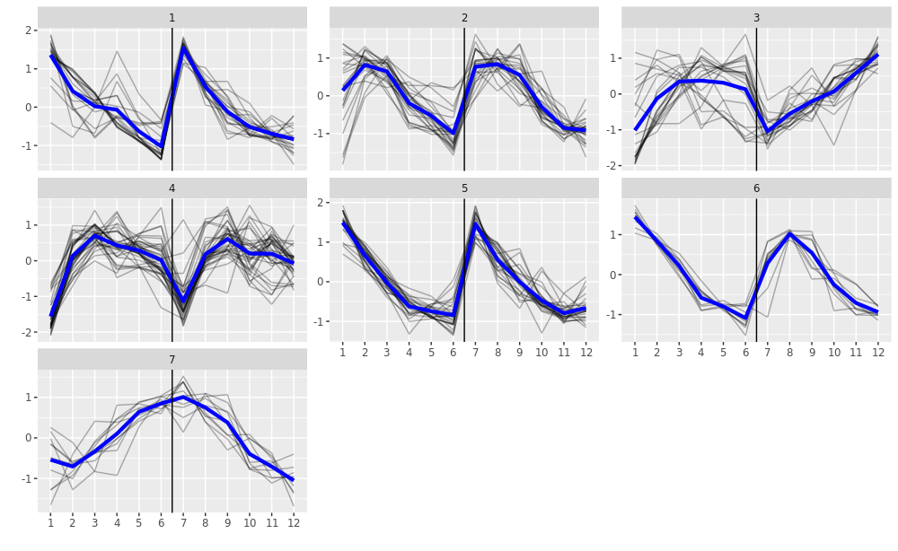

<style>
  .main-container {
    max-width: 1500px !important;
  }
</style>


```{r setup, include=FALSE}
knitr::opts_chunk$set(echo = TRUE)
```

# DF generation (not included in thesis itself)

## Allocation

```{r allocation}

filedir <- "/mnt/schratt/tgermade_test/master_19_20/enrichMiR_benchmark/results/"

# input files: Bartel DEA SE
input <- list(
  bartel.hek=paste0(filedir, "bartel.hek.benchmark.rds"),
  bartel.hek.exon=paste0(filedir, "bartel.hek.exon.benchmark.rds"),
  bartel.hela=paste0(filedir, "bartel.hela.benchmark.rds"),
  bartel.hela.exon=paste0(filedir, "bartel.hela.exon.benchmark.rds"),
  jeong=paste0(filedir, "jeong.benchmark.rds"),
  jeong.exon=paste0(filedir, "jeong.exon.benchmark.rds"),
  rat=paste0(filedir, "ratPolyA.benchmark.rds"),
  rat.exon=paste0(filedir, "ratPolyA.exon.benchmark.rds"),
  
  bartel.hek.mirexpr=paste0(filedir, "bartel.hek.mirexpr.benchmark.rds"),
  bartel.hek.exon.mirexpr=paste0(filedir, "bartel.hek.exon.mirexpr.benchmark.rds"),
  bartel.hela.mirexpr=paste0(filedir, "bartel.hela.mirexpr.benchmark.rds"),
  bartel.hela.exon.mirexpr=paste0(filedir, "bartel.hela.exon.mirexpr.benchmark.rds"),
  rat.mirexpr=paste0(filedir, "ratPolyA.mirexpr.benchmark.rds"),
  rat.exon.mirexpr=paste0(filedir, "ratPolyA.exon.mirexpr.benchmark.rds"),
  
  amin=paste0(filedir, "amin.benchmark.rds"),
  amin.exon=paste0(filedir, "amin.exon.benchmark.rds"),
  cherone.d0=paste0(filedir, "cherone.d0.benchmark2.rds"),
  cherone.d0.exon=paste0(filedir, "cherone.d0.exon.benchmark2.rds"),
  cherone.d1=paste0(filedir, "cherone.d1.benchmark2.rds"),
  cherone.d1.exon=paste0(filedir, "cherone.d1.exon.benchmark2.rds"),
  
  amin.mirexpr=paste0(filedir, "amin.mirexpr.benchmark.rds"),
  amin.exon.mirexpr=paste0(filedir, "amin.exon.mirexpr.benchmark.rds"),
  cherone.d0.mirexpr=paste0(filedir, "cherone.d0.mirexpr.benchmark.rds"),
  cherone.d0.exon.mirexpr=paste0(filedir, "cherone.d0.exon.mirexpr.benchmark.rds"),
  cherone.d1.mirexpr=paste0(filedir, "cherone.d1.mirexpr.benchmark.rds"),
  cherone.d1.exon.mirexpr=paste0(filedir, "cherone.d1.exon.mirexpr.benchmark.rds")
  )

TPs <- c( 
  let.7a = "GAGGUAG", lsy.6 = "UUUGUAU", miR.1 = "GGAAUGU", miR.124 = "AAGGCAC", 
  miR.137 = "UAUUGCU", miR.139 = "CUACAGU", miR.143 = "GAGAUGA", 
  miR.144 = "ACAGUAU", miR.153 = "UGCAUAG", miR.155 = "UAAUGCU", 
  miR.182 = "UUGGCAA", miR.199a = "CCAGUGU", miR.204 = "UCCCUUU", 
  miR.205 = "CCUUCAU", miR.216b = "AAUCUCU", miR.223 = "GUCAGUU", 
  miR.7 = "GGAAGAC", miR.122 = "GGAGUGU", miR.133 = "UGGUCCC", 
  miR.138 = "GCUGGUG", miR.145 = "UCCAGUU", miR.184 = "GGACGGA", 
  miR.190a = "GAUAUGU", miR.200b = "AAUACUG", miR.216a = "AAUCUCA", 
  miR.217 = "ACUGCAU", miR.219a = "GAUUGUC", miR.375 = "UUGUUCG", 
  miR.451a = "AACCGUU", "DKOvWT"="GCUACAU", "DKO"="GCUACAU", 
  "miR.138vNeg"="GCUGGUG", "miR.499vNeg"="UAAGACU", "miR.499"="UAAGACU", 
  "218DKOvWT"="UGUGCUU", "218DKO"="UGUGCUU",
  "138DKOvWT"="CUAUUUC", "138DKO"="CUAUUUC"
  )
```

## Loading

```{r tp}

# import dataframes
df.list <- lapply(input,readRDS)
```

## Prep

```{r, eval=T}

# combine dataframes
df <- do.call("rbind", df.list)
# add information
df$sample <- sapply(strsplit(rownames(df),"\\."), function(x) paste(rev(rev(x)[-1]),collapse="."))
df$dataset <- sapply(strsplit(df$sample,"\\."), function(x) x[1])
df$organism <- sapply(df$dataset, function(x){
  if(x=="bartel" | x=="jeong") "human"
  else if(x=="rat") "rat"
  else if(x=="amin" | x=="cherone" | x=="whipple") "mouse"
})
df$celltype <- sapply(df$sample, function(x){
  if(grepl("hek",x)) "HEK293"
  else if(grepl("hela",x)) "HeLa"
  else if(grepl("jeong",x)) "SNU-638"
  else if(grepl("rat",x)) "hippocampal_neurons/glia"
  else if(grepl("in",x)) "induced_neurons"
  else if(grepl("esc",x)) "ESC"
  else if(grepl("amin",x)) "motoneurons"
  else if(grepl("cherone",x)) "CAD"
})
df$miRNA <- sapply(1:nrow(df), function(i){
  if(df$dataset[i]=="bartel") df$treatment[i]
  else if(df$dataset[i]=="rat" & grepl("miR.138",df$treatment[i])) "miR.138"
  else if(df$dataset[i]=="rat" & grepl("miR.499",df$treatment[i])) "miR.499"
  else if(df$dataset[i]=="jeong") "miR.221/miR.222"
  else if(df$dataset[i]=="amin") "miR.218"
  else if(df$dataset[i]=="cherone") "miR.138"
})
df$seed <- sapply(df$treatment, function(x) TPs[x])
df$design <- factor( sapply(df$dataset, function(x){
  if(x=="bartel" | x=="rat") "transfection"
  else if(x=="jeong" | x=="amin" | x=="cherone" | x=="whipple") "KO"
  }), levels=c("transfection","KO") )
df$exon.specific <- factor( sapply(df$sample, function(x) if(grepl("exon",x)) "exonic" else "unseparated"), levels=c("unseparated","exonic") )
df$mirexpr <- factor( sapply(df$sample, function(x) if(grepl("mirexpr",x)) "mirexpr" else "no_mirexpr"), levels=c("no_mirexpr","mirexpr") )

# we get rid of tests in the wrong direction with respect to intervention (mistake in amin dataset):
df <- df[ (df$design=="transfection" & !grepl("\\.up",df$method)) | 
          (df$design!="transfection" & df$dataset!="amin" & !grepl("\\.down",df$method)) |
          (df$dataset=="amin" & !grepl("\\.up",df$method)), ]
df$method <- gsub("\\.down|\\.up","",df$method)
# get rid of NAs in detPPV
df$detPPV[is.na(df$detPPV)] <- 0

# correct some treatment names
for(x in c("bartel","rat","cherone")){
  df$treatment[df$dataset==x & df$miRNA=="miR.138"] <- paste0("miR.138.",x)
}
df$treatment[df$dataset=="jeong"] <- "miR.221/miR.222"
df$treatment[df$treatment=="miR.499vNeg"] <- "miR.499"
df$treatment[df$treatment %in% c("218DKOvWT","218DKO")] <- "miR.218"

# mark bartel dataset
for(x in unique(df$dataset)){
  if(x=="bartel") df$is.bartel[df$dataset==x] <- "bartel" 
  else df$is.bartel[df$dataset==x] <- "other"
}

# remove lsy.6 bartel
df <- df[df$treatment!="lsy.6",]

# convert columns to factors
for(x in colnames(df)[-which(colnames(df) %in% c("detPPV","FP.atFDR05","log10QDiff","log10QrelIncrease","TP.atFDR05"))]){
  df[[x]] <- as.factor(df[[x]])
}

# variables
#dea.names <- as.character(unique(df$treatment))
#props.all <- levels(df$prop)
```

```{r export df, eval=F}

# export df
saveRDS(df, "results3/combined.benchmark.rds")
```

```{r import df, eval=F}

df <- readRDS("results3/combined.benchmark.rds")
```


# Thesis R Code

## functions

```{r libraries, message=FALSE, warning=FALSE, echo=FALSE}
suppressPackageStartupMessages({
  library(ggplot2)
  library(plgINS)
  library(DT)
  library(viridis)
  library(RColorBrewer)
  library(data.table)
  library(dplyr)
  library(cowplot)
  library(matrixStats)
  library(RUVSeq)
  library(ggrepel)
  library(grid)
  library(ComplexHeatmap)
  library(kableExtra)
})
```

```{r HM1 function, message=FALSE, warning=FALSE, echo=FALSE}
# create heatmap matrix
MHv1 <- function(df, metric="detPPV", form=method+is.bartel~prop, fn=mean, hm=c("1","2"), data.annotate=FALSE, name, ...){
  
  # reshape data
  m <- reshape2::dcast(df, form=form, value.var=metric, na.rm=TRUE, fun.aggregate=fn)
  
  if(hm==1){
    # generate matrix & annotations
    ds <- as.character(m$dataset)
    ds.bartel <- as.character(m$is.bartel)
    names(ds) <- names(ds.bartel) <- rownames(m) <- m[,1]
    m <- m[,-c(1:3)]
    ds2 <- NULL
    splt <- factor(ds.bartel, levels=c("bartel","other"))
    lbl <- colnames(m)
    
  } else if(hm==2){
    # generate matrix & annotations
    l <- split(m, m$is.bartel)
    m <- cbind(l$other[,-2],l$bartel[,-c(1:2)])
    rownames(m) <- m[,1]
    m <- m[,-1]
    ds2 <- factor(c(rep("other",4),rep("bartel",4)), levels=c("other","bartel"))
    splt <- NULL
    lbl <- rep(colnames(m)[1:4],2)
  }
  
  # heatmap
  if(!data.annotate){
    hm <- ComplexHeatmap::Heatmap(m, name=name, cluster_columns=FALSE, 
                                rect_gp=gpar(col="white",lwd =.5),
                                column_split=ds2, row_split=splt,
                                column_title=levels(ds2),
                                column_labels=lbl, 
                                row_gap=unit(2,"mm"), 
                                ...)
    return(hm)
    
    } else {
      hm2 <- ComplexHeatmap::Heatmap(ds, name="dataset", 
                                   col=colors$dataset, 
                                   ...)
      return(hm2)
    }
}
```

```{r HM2 function, message=FALSE, warning=FALSE, echo=FALSE}

# create heatmap matrix
MHv2 <- function(df, metric="TP.atFDR05", form=treatment+dataset+sample+mirexpr~prop, fn=mean, data.annotate=FALSE, name=name, ...){
  
  # reshape data
  m <- reshape2::dcast(df, form=form, value.var=metric, na.rm=TRUE, fun.aggregate=fn)
  
  # allocation
  if(any(grepl("mirexpr",as.character(form)))){
    feature <- "mirexpr"
    lvls <- c("no_mirexpr","mirexpr")
  } else {
    feature <- "exon.specific"
    lvls <- c("unseparated","exonic")
  }
  
  # generate matrix & annotations
  l <- split(m, m[[feature]])
  l <- lapply(l, function(x) aggregate(x[,-c(1:4)], by=list(x[,1],x[,2]), FUN="mean"))
  m <- cbind(l[[lvls[1]]][,-2],l[[lvls[2]]][,-c(1:2)])
  ds <- as.character(l[[lvls[1]]]$Group.2)  
  ds.bartel <- sapply(ds, function(x) if(x=="bartel") "bartel" else "other")
  names(ds) <- names(ds.bartel) <- rownames(m) <- m$Group.1
  m <- m[,-1]
  ds2 <- factor(c(rep(lvls[[1]],4),rep(lvls[[2]],4)), levels=lvls)
  
  if(any(grepl("mirexpr",as.character(form)))){
    ha <- HeatmapAnnotation(mir=ds2, col=colors, annotation_legend_param=list(title=feature),
                          show_annotation_name=FALSE)
  } else {
    ha <- HeatmapAnnotation(ex=ds2, col=colors, annotation_legend_param=list(title=feature),
                          show_annotation_name=FALSE)
  }
  
  # heatmap
  if(!data.annotate){
  hm <- ComplexHeatmap::Heatmap(m, name=name, cluster_columns=FALSE, rect_gp=gpar(col="white",lwd =.5),
                               column_split=ds2, 
                               row_split=factor(ds.bartel, levels=c("bartel","other")),
                               column_labels=rep(colnames(m)[1:4],2), 
                               column_title=metric,
                               row_gap=unit(2,"mm"), column_gap=unit(2,"mm"), 
                               top_annotation=ha, ...)
  return(hm)
  
  } else {
    hm2 <- ComplexHeatmap::Heatmap(ds, name="dataset", col=colors$dataset, ...)
    return(hm2)
  }
}
```

```{r pval function, message=FALSE, warning=FALSE, echo=FALSE}

# function to do lin-reg
getPval <- function(form, df, dset, opt=c("mir","ex")){
  if(!missing(dset)){
    pvals <- summary(lm(form, data=subset(df, dataset==dset), na.action=na.exclude))
  } else {
    pvals <- summary(lm(form, data=df, na.action=na.exclude))
  }
  if(opt=="mir"){
    p <- pvals$coefficients["mirexprmirexpr","Pr(>|t|)"]
  } else {
    p <- pvals$coefficients["exon.specificexonic","Pr(>|t|)"]
  }
  #names(p) <- opt
  if(is.na(p)){
    return(1)
  } else {
    return(p)
  }
}
```

```{r round function, message=FALSE, warning=FALSE, echo=FALSE}

# function to round numeric dataframe columns
doRound <- function(df){
  for(i in 1:ncol(df)){ 
    if(is.numeric(df[,i])){
      df[,i] <- plgINS::dround(df[,i], roundGreaterThan1=TRUE)
      }
    }
  return(df)
}
```

## load

```{r import df, echo=FALSE}

#df <- readRDS("../results/combined.benchmark.rds")
e <- readRDS("../../iPSCdiff/enrichMiR/results/longRNA.mirexpr.enrichMiR.rds")
TS <- readRDS("../data/TargetScan_human.rds")
se <- readRDS("../../iPSCdiff/data/Long_RNA/longRNA.DEA.SE.rds")
se.small <- readRDS("../../iPSCdiff/data/Small_RNA/smallRNA_oasis.DEA.SE.rds")

for(i in colnames(rowData(se.small))){
  rowData(se.small)[[i]] <- DataFrame(rowData(se.small)[[i]])
}
```

## Prep

```{r, echo=FALSE}

# dataframe subsets
df.std <- df[df$mirexpr=="no_mirexpr" & df$exon.specific=="unseparated",]
df.mir <- df[df$mirexpr=="mirexpr" & df$exon.specific=="unseparated",]
df.ex <- df[df$mirexpr=="no_mirexpr" & df$exon.specific=="exonic",]
```

```{r, echo=FALSE}

# color palette dataset
newCols <- colorRampPalette(grDevices::hcl.colors(length(unique(df$dataset)),palette = hcl.pals()[107]))
cols.data <- newCols(length(unique(df$dataset)))
names(cols.data) <- levels(df$dataset)
# color palette method
set.seed(111)
colourCount = length(levels(df$method))
getPalette = colorRampPalette(brewer.pal(9, "Set1")[-6])
cols.method <- structure(sample(getPalette(colourCount)), names=levels(df$method))
# color palette design
cols.design <- structure(cols.method[c(4,5)], names=levels(df$design))
# color palette mirexpr
cols.mir <- structure(cols.design, names=levels(df$mirexpr))
# color palette exon.specific
cols.ex <- structure(cols.design, names=levels(df$exon.specific))

colors <- list(dataset=cols.data, 
               method=cols.method, 
               design=cols.design,
               mir=cols.mir, 
               ex=cols.ex)
```

## Plots

```{r FIGURE_HM1, message=FALSE, warning=FALSE, fig.dim=c(4,4), echo=FALSE, fig.align="center", fig.cap="Heatmap of detPPV scores across experiments and miRNA target list permutations. One of the scores we used to evaluate the performance of the enrichMiR tests we called detPPV. This score represents the relative rank of the true miRNA family relative to non-true families. Its values range from 0 to 1. With few exceptions the enrichMiR scores for each sample either slightly decreased with each level of permutation or stayed constant. The score differences between the treatments were more striking, revealing their degree of difficulty regarding enrichMiR analysis. In the Jeong and Cherone datasets detection of the true family largely failed.  "}

# generate color gradient for TP
hm.col <- circlize::colorRamp2(c(.2,.7,1),c("#043495","#f4da71","#bd0f0f"), space="RGB")
# generate heatmaps
hm1 <- MHv1(df.std, name="detPPV", form=treatment+dataset+is.bartel~prop,
            hm=1, show_row_dend=FALSE, col=hm.col,
            column_title_gp=gpar(fontsize=11),
            row_title_gp = gpar(fontsize = 11),
            column_names_gp=gpar(fontsize = 9),
            row_names_gp=gpar(fontsize = 9)
            )
hm2 <- MHv1(df.std, data.annotate=TRUE, form=treatment+dataset+is.bartel~prop,
            hm=1, show_row_names=TRUE, width = unit(5, "mm"),
            column_title_gp=gpar(fontsize=11),
            row_title_gp = gpar(fontsize = 11),
            column_names_gp=gpar(fontsize = 9),
            row_names_gp=gpar(fontsize = 8)
            )
# plot
draw(hm1 + hm2, ht_gap = unit(.2, "cm"), show_row_dend=FALSE)
```

```{r FIGURE_HM2, message=FALSE, warning=FALSE, fig.dim=c(5,4), echo=FALSE, fig.align="center", fig.cap="Heatmap of detPPV scores across methods and miRNA target list permutations. The samples are split up according to their membership to either Bartel or other datasets. The displayed scores are mean detPPV values across samples. In all cases except for regmir the performance of enrichMiR analysis methods was higher for samples stemming from Bartel. In all but a few cases the scores either gradually declined or remained constant with increased degrees of miRNA target list permutation (x-axis). See Tables 1 and 2 for summaries of the enrichMiR methods."}

# generate color gradient for TP
hm.col <- circlize::colorRamp2(c(0.2,.6,1),c("#043495","#f4da71","#bd0f0f"), space="RGB")
# generate heatmaps
hm1 <- MHv1(df.std, metric="detPPV", name="detPPV", hm=2,
            show_row_dend=FALSE, col=hm.col, column_gap=unit(2,"mm"),
            column_title_gp=gpar(fontsize=11),
            row_title_gp = gpar(fontsize = 11),
            column_names_gp=gpar(fontsize = 9),
            row_names_gp=gpar(fontsize = 9)
            )
hm1
```

```{r, message=FALSE, warning=FALSE, echo=FALSE}

# FP-TP plot (at FDR .05)

## get average number of FP & TP at FDR .05 for each combination of permutation & method & mirexpr
df.agg <- aggregate(df.std[,c("FP.atFDR05","TP.atFDR05")], by=df.std[,c("prop","method","dataset","sample","design")], FUN=mean)
df.agg$dataset <- as.character(df.agg$dataset)
df.agg$dataset[df.agg$sample=="bartel.hela"] <- as.character(df.agg$sample[df.agg$sample=="bartel.hela"])
df.agg$dataset[df.agg$sample=="bartel.hek"] <- as.character(df.agg$sample[df.agg$sample=="bartel.hek"])
df.agg$dataset <- factor(df.agg$dataset)
df.agg <- aggregate(df.agg[,c("FP.atFDR05","TP.atFDR05")], by=df.agg[,c("prop","method","dataset","design")], FUN=mean)
```

```{r FIGURE_TP_FP_std, message=FALSE, warning=FALSE, fig.dim=c(8,6), echo=FALSE, fig.align="center", fig.cap="Comparing False-Positive (FP) and True-Positive (TP) discoveries for each enrichMiR method by their experimental design. The different shapes of the datapoints reflect the mean values achieved under the different levels of miRNA target list permutation we performed. True family detection failed for all tests in both the Cherone and the Jeong datasets, with a notable exception being the michael method."}

set.seed(123)
ggplot(df.agg, aes(x=FP.atFDR05, y=TP.atFDR05, color=method, shape=prop, group=method)) + 
  geom_line() + 
  #guides(color=FALSE) +
  geom_point(size=2.5) + 
  geom_label_repel(data=subset(df.agg, method %in% c("wEN","EN","michael",
                                                          "regmir","KS2","combGeom.3",
                                                          "aREAmir")) 
                   %>% filter(prop=="original"), 
                  aes(label=method), 
                  force=20, 
                  size=2.8,
                  ylim=c(.05,.95), xlim=c(1,15),
                  segment.color="black",
                  segment.alpha=.2, 
                  arrow=arrow(length = unit(0,"npc"), type = "open", ends = "last"),
                  box.padding = unit(.55, "lines"),
                  point.padding = unit(.45, 'lines'),
                  nudge_y=-.2, nudge_x=3
                  ) +
  geom_point() +
  scale_color_manual(values = colors$method) +
  facet_wrap(design~dataset) + 
  scale_x_sqrt() +
  theme_cowplot() +
  theme(panel.border=element_rect(colour = "grey35", fill = NA),
        panel.grid.major=element_line(colour = "grey85"), 
        axis.line=element_blank(),
        strip.background=element_rect(colour = "grey35"),
        axis.ticks=element_line(colour = "grey35"),
        text = element_text(size=10), axis.text = element_text(size=9)
        )
```

```{r FIGURE_BOX_std, message=FALSE, warning=FALSE, fig.dim=c(8,5.5), echo=FALSE, fig.align="center", fig.cap="Comparison of log10QDiff scores between the different enrichMiR methods for each dataset. The log10QDiff score represents the distance between the true miRNA family and the highest ranking non-true  family in terms of FDR value. The Cherone and Jeong datasets again didn’t perform well, with many FDR values being equal to 1. The Rat dataset showed similarly low distances while still achieving high true family discovery rates (see Figure 5). In all other datasets the highest log10QDiff scores were recorded among the combined methods, in particular the ones combined using the Fisher method."}

df.std2 <- df.std
df.std2$dataset <- as.character(df.std2$dataset)
df.std2$dataset[df.std2$sample=="bartel.hela"] <- as.character(df.std2$sample[df.std2$sample=="bartel.hela"])
df.std2$dataset[df.std2$sample=="bartel.hek"] <- as.character(df.std2$sample[df.std2$sample=="bartel.hek"])
df.std2$dataset <- factor(df.std2$dataset)

# Score distributions: box (method)
ggplot(df.std2, aes(x=method, y=log10QDiff, fill=method)) + geom_boxplot() +
  guides(fill=FALSE) + ylab("log10QDiff") + coord_flip() + scale_x_discrete(limits = rev(levels(df$method))) +
  facet_wrap(design~dataset) + geom_hline(yintercept = 0, linetype = "dotted", size = .5) +
  scale_fill_manual(values = colors$method) +
  theme_cowplot() + 
  theme(axis.line=element_line(colour = "grey35"), 
        axis.ticks=element_line(colour = "grey35"),
        strip.background=element_rect(colour = "grey35"),
        text = element_text(size=10), axis.text = element_text(size=9)
        )
```

```{r mir stats, message=FALSE, warning=FALSE, echo=FALSE}

# Score distributions: box (method)
df.mir2 <- df[df$exon.specific=="unseparated" & df$dataset!="jeong",]
df.mir2$log10QDiff[is.infinite(df.mir2$log10QDiff)] <- NA
df.mir2$mirexpr <- relevel(droplevels(df.mir2$mirexpr), ref="no_mirexpr")

df.mir2$dataset <- as.character(df.mir2$dataset)
df.mir2$dataset[grepl("bartel.hela",df.mir2$sample)] <- as.character(df.mir2$sample[df.mir2$sample=="bartel.hela"])
df.mir2$dataset[grepl("bartel.hek",df.mir2$sample)] <- as.character(df.mir2$sample[df.mir2$sample=="bartel.hek"])
df.mir2$dataset <- factor(df.mir2$dataset)

# get pvalues overall
p.values.TP.all.mir <- getPval(form=TP.atFDR05 ~ method + dataset + mirexpr, df=df.mir2, opt="mir")
p.values.FP.all.mir <- getPval(form=FP.atFDR05 ~ method + dataset + mirexpr, df=df.mir2, opt="mir")

# get pvalues per dataset
p.values.TP.mir <- sapply(as.character(unique(df.mir2$dataset)), getPval, form=TP.atFDR05 ~ method + mirexpr, df=df.mir2, opt="mir")
p.values.FP.mir <- sapply(as.character(unique(df.mir2$dataset)), getPval, form=FP.atFDR05 ~ method + mirexpr, df=df.mir2, opt="mir")
```

```{r, message=FALSE, warning=FALSE, echo=FALSE}
# take subset
df.sub <- df[df$exon.specific=="unseparated" & df$dataset!="jeong",]
# generate color gradient for TP
hm.col1 <- circlize::colorRamp2(c(0.2,.6,1),c("#043495","#f4da71","#bd0f0f"), space="RGB")
hm.col2 <- circlize::colorRamp2(seq(5,50,length=3),c("#043495","white","#bd0f0f"), space="RGB")
# generate heatmaps
hm1 <- MHv2(df.sub, col=hm.col1, name="TP rate",
            column_title_gp=gpar(fontsize=12),
            row_title_gp = gpar(fontsize=12),
            column_names_gp=gpar(fontsize=9),
            row_names_gp=gpar(fontsize=9)
            )
hm2 <- MHv2(df.sub, metric="FP.atFDR05", col=hm.col2, name="FP rate",
            column_title_gp=gpar(fontsize=12),
            row_title_gp = gpar(fontsize=12),
            column_names_gp=gpar(fontsize=9),
            row_names_gp=gpar(fontsize=9)
            )
hm3 <- MHv2(df.sub, data.annotate=TRUE, show_row_names=TRUE, width = unit(5, "mm"),
            column_title_gp=gpar(fontsize=12),
            row_title_gp = gpar(fontsize=12),
            column_names_gp=gpar(fontsize=9),
            row_names_gp=gpar(fontsize=9)
            )
```

```{r FIGURE_HM3, message=FALSE, warning=FALSE, fig.dim=c(8,5), echo=FALSE, fig.align="center", fig.cap="Heatmaps showing the difference of True-Positive rate (TPR) and False-Positives (FPs) across treatments with and without supplementation of miRNA expression (mirexpr) profiles to enrichMiR. In all cases we either saw an increase in TPR or no change at all when comparing enrichMiR analyses performed without and with mirexpr profiles. The same comparison revealed large decreases in FPs in an overwhelming majority of cases. Both, increases in TPR and decreases in FPs were significant."}
# plot
draw(hm1 + hm2 + hm3, ht_gap = unit(c(.5,.2), "cm"), show_row_dend=FALSE)
```

```{r exo stats, message=FALSE, warning=FALSE, echo=FALSE}

# Score distributions: box (method)
df.ex2 <- df[df$mirexpr=="no_mirexpr",]
df.ex2$log10QDiff[is.infinite(df.ex2$log10QDiff)] <- NA
df.ex2$exon.specific <- relevel(droplevels(df.ex2$exon.specific), ref="unseparated")

df.ex2$dataset <- as.character(df.ex2$dataset)
df.ex2$dataset[grepl("bartel.hela",df.ex2$sample)] <- as.character(df.ex2$sample[df.ex2$sample=="bartel.hela"])
df.ex2$dataset[grepl("bartel.hek",df.ex2$sample)] <- as.character(df.ex2$sample[df.ex2$sample=="bartel.hek"])
df.ex2$dataset <- factor(df.ex2$dataset)

# get pvalues overall
p.values.TP.all.ex <- getPval(form=TP.atFDR05 ~ method + dataset + exon.specific, df=df.ex2, opt="ex")
p.values.FP.all.ex <- getPval(form=FP.atFDR05 ~ method + dataset + exon.specific, df=df.ex2, opt="ex")

# get pvalues per dataset
p.values.TP.ex <- sapply(as.character(unique(df.ex2$dataset)), getPval, form=TP.atFDR05 ~ method + exon.specific, df=df.ex2, opt="ex")
p.values.FP.ex <- sapply(as.character(unique(df.ex2$dataset)), getPval, form=FP.atFDR05 ~ method + exon.specific, df=df.ex2, opt="ex")
```

```{r FIGURE_TP_FP_exonic, message=FALSE, message=FALSE, warning=FALSE, fig.dim=c(8,9), echo=FALSE, fig.align="center", fig.cap="Comparison of FPs and TPR for each enrichMiR method by dataset and exon specificity of DEA profiles. The datapoints represent score means across TS permutations. Across all datasets the TP rates achieved by the individual methods significantly decreased. Notable exceptions could be seen in the Amin dataset where regmir experienced a large increase and the Jeong dataset where michael more moderately increased as well. In the Rat dataset we observed a complete failure of any method except MW and KS to detect any TPs. At the same time the overall FPs decreased significantly as well."}

# FP-TP plot (at FDR .05)

df.agg <- aggregate(df[,c("FP.atFDR05","TP.atFDR05")], by=df[,c("method","exon.specific","dataset","design")], FUN=mean)

set.seed(123)
ggplot(df.agg, aes(x=FP.atFDR05, y=TP.atFDR05, color=method)) + 
  guides() +
  coord_cartesian(ylim = c(0,1)) +
  geom_point(size=2.5) + 
  geom_label_repel(data=subset(df.agg, method %in% c("wEN","EN","michael",
                                                     "regmir","KS2","combGeom.3",
                                                     "aREAmir")), 
                  aes(label=method), 
                  force=10, 
                  size=3,
                  ylim=c(.05,.98), xlim=c(.1,12),
                  segment.color="black",
                  segment.alpha=.2, 
                  arrow=arrow(length = unit(0,"npc"), type = "open", ends = "last"),
                  box.padding = unit(.5, "lines"),
                  point.padding = unit(.55, 'lines'),
                  nudge_y=0, nudge_x=2
                  ) +
  geom_point() +
  scale_color_manual(values = colors$method) +
  facet_grid(design+dataset ~ exon.specific) + 
  scale_x_sqrt() +
  theme_cowplot() +
  theme(panel.border=element_rect(colour = "grey35", fill = NA),
        panel.grid.major=element_line(colour = "grey85"), 
        axis.line=element_blank(),
        strip.background=element_rect(colour = "grey35"),
        axis.ticks=element_line(colour = "grey35"),
        text = element_text(size=11), axis.text = element_text(size=10)
        )
```

```{r FIGURE_HM4, message=FALSE, warning=FALSE, fig.dim=c(9,6), echo=FALSE, fig.align="center", fig.cap="Heatmaps showing  TPR and FPs across experiments upon running ernrichMiR with and without exon-specific DEA profiles. The values of each treatment are subdivided into the different levels of miRNA target list permutations. Across all treatments we observed a significant decrease in TPR and FPs."}

# take subset
df.sub <- df[df$mirexpr=="no_mirexpr",]
# generate color gradient for TP
hm.col1 <- circlize::colorRamp2(c(0,.6,1),c("#043495","#f4da71","#bd0f0f"), space="RGB")
hm.col2 <- circlize::colorRamp2(seq(5,50,length=3),c("#043495","white","#bd0f0f"), space="RGB")
# generate heatmaps
hm1 <- MHv2(df.sub, col=hm.col1, name="TP rate", 
            form=treatment+dataset+sample+exon.specific~prop,
            column_title_gp=gpar(fontsize=12),
            row_title_gp = gpar(fontsize=12),
            column_names_gp=gpar(fontsize=9),
            row_names_gp=gpar(fontsize=9)
            )
hm2 <- MHv2(df.sub, metric="FP.atFDR05", col=hm.col2, name="FP rate", 
            form=treatment+dataset+sample+exon.specific~prop,
            column_title_gp=gpar(fontsize=12),
            row_title_gp = gpar(fontsize=12),
            column_names_gp=gpar(fontsize=9),
            row_names_gp=gpar(fontsize=9)
            )
hm3 <- MHv2(df.sub, data.annotate=TRUE, show_row_names=TRUE, width=unit(5, "mm"), 
            form=treatment+dataset+sample+exon.specific~prop,
            column_title_gp=gpar(fontsize=12),
            row_title_gp = gpar(fontsize=12),
            column_names_gp=gpar(fontsize=9),
            row_names_gp=gpar(fontsize=9)
            )
# plot
draw(hm1 + hm2 + hm3, ht_gap = unit(c(.5,.2), "cm"), show_row_dend=FALSE)
```

```{r pca, message=FALSE, warning=FALSE, fig.dim=c(4,2.3), echo=FALSE, fig.align="center", fig.cap="A Principal Component Analysis (PCA) over the different stages and replicates of our Ngn2-mediated neurodifferentiation dataset reveals a large initial change in expression patterns when neuralizing and a subsequent trajectory of further maturation. Each PC captures one trajectory almost fully, with the initial neuralization step representing the most dominant component."}

pca <- prcomp(t(assays(se)$logcpm))
d <- cbind(pca$x, as.data.frame(colData(se)))
ggplot(d, aes(PC1, PC2, colour=stage)) + geom_point() + xlab(paste("PC1 (", round(pca$sdev[1]/sum(pca$sdev) * 
        100, 0), "%)", sep = "")) + ylab(paste("PC2 (", round(pca$sdev[2]/sum(pca$sdev) * 
        100, 0), "%)", sep = "")) + 
  geom_hline(yintercept = 0, color="grey", size = .2) +
  geom_vline(xintercept = 0, color="grey", size = .2) +
  theme_cowplot() +
  theme(axis.line=element_blank(), 
        axis.ticks=element_line(colour = "grey"),
        strip.background=element_rect(colour = "grey35"),
        panel.border=element_rect(colour = "grey", fill = NA),
        text = element_text(size=10), axis.text = element_text(size=9)
        )
```

```{r FIGURE_HM_NGN, message=FALSE, warning=FALSE, fig.dim=c(8,5), echo=FALSE, fig.align="center", fig.cap="Transcriptional changes of different marker genes provide evidence for a divergence from a pluripotent state as well as neuronal differentiation and maturation."}

gl <- list( pluripotency=c("POU5F1","NANOG","LIN28A"), "neural fate"=c("PAX6","SOX2","NEUROD2","NEUROG1","NEUROD1","NEUROG2","STMN2"), 
            "neuronal identity/maturation"=c("SNAP25","CAMK2A","SLC17A7","GAD1","DLG4","GRIN2A","SYN1"), astro="GFAP")
gl <- lapply( gl, FUN=function(x) sapply(x,FUN=function(x) grep(paste0("\\.",x,"$"), row.names(se), value=TRUE)))
gtypes <- rep(names(gl), lengths(gl))
names(gtypes) <- unlist(gl)
rowData(se)$type <- gtypes[row.names(se)]
SEtools::sehm(se, unlist(gl), assayName="logcpm", anno_columns="day",
              hmcols=viridisLite::viridis(100), anno_rows="type", toporder="type")
```

```{r FIGURE_CIRC, out.width="320pt", echo=FALSE, fig.align="center", fig.cap="Combined expression patterns of circular and linear counterparts across neuronal maturation stages of Ngn2 programmed hiPSC cells. Smoothed relative expression patterns were combined for visual analysis. Each subplot represents a cluster of genes similarly regulated. To the left of the vertical line are the linear and to the right the circular transcript expressions. Circular and linear RNA derived from the same gene often show co-expression. A divergent expression pattern is evidence for targeted circRNA regulation and thus a functional role in a given context. We were thus primarily interested in clusters 3 and 7. Among these the most differentially expressed circRNAs were BAZ2B and RTN4 respectively. A more detailed list can be seen in Figure 16."}

```

```{r, message=FALSE, warning=FALSE, echo=FALSE}

# consider only the last 2 stage comparisons
e.sub <- e[c("33v27","40v33")]
# remove NAs
e.sub <- lapply(e.sub, function(e){
  new <- lapply(e@res, function(x){
    x$FDR[is.na(x$FDR)] <- 1
    return(x)
  })
  return(new)
})

# get miRNA family results from michael methods
sig.l <- lapply(e.sub, function(e) sapply(e, function(x) rownames(x[x$FDR<.05,])) )
m.seeds <- unlist(lapply(sig.l, function(x) x[grepl("michael",names(x))]))
m.mirna <- lapply(m.seeds, function(x) e[[1]]@families[e[[1]]@families==x])
```

```{r, message=FALSE, warning=FALSE, echo=FALSE}

# for each miRNA family get targets
m.targets <- sapply(m.seeds, function(x) as.character(TS$feature[TS$family==x]))
names(m.targets) <- m.seeds

# GO term enrichment (dataframe, for each miRNA seperately)
background <- unique(gsub(".*\\.", "", rownames(se)))
go.list <- lapply(m.targets, function(x) goseq.enrichment(background, unlist(x), cutoff.onFDR = FALSE, cutoff = 0.5) )

# go through all GO results and filter out significant instances with neuro-related terms
d <- data.frame(c())
go.neuro <- lapply(names(go.list), function(i) 
  for(x in c("neur","brain","synap","dendr")){ 
    new <- go.list[[i]][grepl(x,go.list[[i]]$Term) & go.list[[i]]$FDR<.05, colnames(go.list[[i]])!="genes"]
    if(nrow(new)!=0 & nrow(d)!=0){
      d <- rbind(d, new)
    } else if(nrow(new)!=0){
      d <- new
    }
    return(d)
    })
names(go.neuro) <- names(go.list)

# generate table of neuro GO terms and their miRNAs
for(i in names(go.neuro)) if(nrow(go.neuro[[i]])>0) go.neuro[[i]]$seed <- i
go.neuro$ACAUUCA$miRNA <- "hsa-miR-181"
go.neuro$UGCAUAG$miRNA <- "hsa-miR-153-3p"
# modify
go.neuro <- merge(go.neuro$ACAUUCA, go.neuro$UGCAUAG, all=TRUE)
rownames(go.neuro) <- go.neuro[,1]
go.neuro <- go.neuro[order(go.neuro$miRNA, go.neuro$FDR),-1]
# round
go.neuro <- doRound(go.neuro)
```

```{r, message=FALSE, warning=FALSE, echo=FALSE}

# create table of enrichMiR results for REPORT
michi <- lapply(e.sub, function(e) e[grepl("michael",names(e))] )
michi.sig <- lapply(michi, function(x) lapply(x, function(y) y[y$FDR<.05,] ))
michi.sig.a <- do.call("rbind",michi.sig$`33v27`)
michi.sig.b <- do.call("rbind",michi.sig$`40v33`)
michi.sig.a$test <- "michael.up"
michi.sig.a$dea <- "33v27"
michi.sig.b$test <- "michael.down"
michi.sig.b$dea <- "40v33"
michi <- rbind(michi.sig.a, michi.sig.b)

m.mirna.all <- c(m.mirna[[1]],m.mirna[[2]],m.mirna[[3]],m.mirna[[4]])

# final dataframe
df.table <- data.frame(
  family=m.mirna.all,
  miRNA=names(m.mirna.all),
  michael.FDR=sapply(m.mirna.all, function(x) michi[x,"FDR"]),
  miRNA.logFC.33v27=sapply(names(m.mirna.all), function(x) rowData(se.small)$DEA.33v27$logFC[rownames(se.small)==x]),
  miRNA.FDR.33v27=sapply(names(m.mirna.all), function(x) rowData(se.small)$DEA.33v27$FDR[rownames(se.small)==x]),
  miRNA.logFC.40v33=sapply(names(m.mirna.all), function(x) rowData(se.small)$DEA.40v33$logFC[rownames(se.small)==x]),
  miRNA.FDR.40v33=sapply(names(m.mirna.all), function(x) rowData(se.small)$DEA.40v33$FDR[rownames(se.small)==x]),
  miRNA.mean.logCPM=rowMeans(cbind(
    sapply(names(m.mirna.all), function(x) rowData(se.small)$DEA.33v27$logCPM[rownames(se.small)==x]),
    sapply(names(m.mirna.all), function(x) rowData(se.small)$DEA.40v33$logCPM[rownames(se.small)==x])) )
)
# round
df.table <- doRound(df.table)
```

```{r, echo=FALSE}
kable(go.neuro, "latex", booktabs=T, caption = "Enriched GO terms for miR-153 and miR-181 detected in our Ngn2 neurodifferentiation dataset by enrichMiR."
      )%>%kable_styling(latex_options =c("striped", "scale_down"))
```

```{r, echo=FALSE}
de.nr <- data.frame(longRNA.DE.nr=sapply(colnames(rowData(se))[-c(1:3,length(colnames(rowData(se))))], 
                                         function(x) sum(rowData(se)[[x]]$FDR<0.05)), 
                    smallRNA.DE.nr=sapply(colnames(rowData(se.small)), 
                                          function(x) sum(rowData(se.small)[[x]]$FDR<0.05))
                    )
kable(de.nr, "latex", booktabs = T, caption = "Number of differentially expressed transcripts per RNA-seq dataset over the different recorded stages of Ngn2 neurodifferentiation. DEA.all is the comparison between all neuronal stages (stages 9, 15, 21, 27, 33 and 40) and the initial undifferentiated state (day 0). DEA.neuronal is the comparison between all later neuronal stages (stages, 15, 21, 27, 33 and 40) to the first neuronal stage (stage 9). All other DEAs represent sequential pair-wise analyses over all stages."
      )%>%kable_styling(latex_options ="striped")
```

```{r FIGURE_TP_FP_mirexpr, message=FALSE, warning=FALSE, fig.dim=c(7,7), echo=FALSE, fig.align="center", fig.cap="Comparison of FPs and TPR for each enrichMiR method by supplementation of miRNA expression profiles. Each datapoint of a single color reflects the mean FPs and TPR across the samples of a respective dataset and across TS perturbations. In most cases the FP numbers decreased upon supplementation of miRNA expression data (mirexpr). The largest differences in TPR could be observed for the GSEA and KS2 methods, both increasing. Both FP and TPR changes were significant."}


# FP-TP plot (at FDR .05)

## select only datasets that can be compared in terms of mirexpr (not all datasets are run with mirexpr)
df.sub <- df[df$dataset %in% df$dataset[df$mirexpr=="mirexpr"] & df$exon.specific=="unseparated",]

df.agg <- aggregate(df.sub[,c("FP.atFDR05","TP.atFDR05")], by=df.sub[,c("method","mirexpr","dataset","design")], FUN=mean)

set.seed(123)
ggplot(df.agg, aes(x=FP.atFDR05, y=TP.atFDR05, color=method)) + 
  guides() +
  coord_cartesian(ylim = c(0,1)) +
  geom_point(size=2.5) + 
  geom_label_repel(data=subset(df.agg, method %in% c("wEN","EN","michael",
                                                     "regmir","KS2","combGeom.3",
                                                     "aREAmir")), 
                  aes(label=method), 
                  force=11, 
                  size=2.8,
                  ylim=c(.05,.98), xlim=c(.5,15),
                  segment.color="black",
                  segment.alpha=.2, 
                  arrow=arrow(length = unit(0,"npc"), type = "open", ends = "last"),
                  box.padding = unit(.55, "lines"),
                  point.padding = unit(.55, 'lines'),
                  nudge_y=-.2, nudge_x=3.5
                  ) +
  geom_point() +
  scale_color_manual(values = colors$method) +
  facet_grid(design+dataset ~ mirexpr) + 
  scale_x_sqrt() +
  theme_cowplot() +
  theme(panel.border=element_rect(colour = "grey35", fill = NA),
        panel.grid.major=element_line(colour = "grey85"), 
        axis.line=element_blank(),
        strip.background=element_rect(colour = "grey35"),
        axis.ticks=element_line(colour = "grey35"),
        text = element_text(size=10), axis.text = element_text(size=9)
        )
```

```{r FIGURE_BOX_mir, message=FALSE, warning=FALSE, fig.dim=c(9,7.5), echo=FALSE, fig.align="center", fig.cap="Comparison of False-Positive (FP) numbers between enrichMiR analyses with and without supplementation of miRNA expression (mirexpr) profiles for all methods. The FP values (x-axis) are split according to their dataset membership and experimental design. For each dataset the corresponding p-value is displayed, relaying the significance of the mirexpr supplementation effect across all methods. For all datasets except Rat the FPs showed a significant decrease."}

# round p values
pRound <- function(p){
  if(p<.001){
    return(formatC(p, format = "e", digits = 1))
  } else {
    return(round(p,3))
  }
}

p.values.FP.mir <- sapply(p.values.FP.mir, pRound)

lab.df <- data.frame(x=18.5, y=150, 
                     design=c(rep("transfection",3),rep("KO",2)), 
                     pvals=paste0("pval=",p.values.FP.mir), 
                     dataset=names(p.values.FP.mir), 
                     mirexpr=rep("mirexpr",length(p.values.FP.mir)))

ggplot(df.mir2, aes(x=method, y=FP.atFDR05, fill=mirexpr)) + geom_boxplot() +
  ylab("FP.atFDR05") + coord_flip() + scale_x_discrete(limits = rev(levels(df$method))) +
  scale_fill_manual(values = colors$mir) +
  theme_cowplot() + facet_wrap(design~dataset) +
  geom_label(aes(x=x,y=y,label=pvals, fill=NULL), data=lab.df,inherit.aes=T, parse=FALSE) +
  theme(panel.grid.major.y=element_line(colour = "grey"),
        axis.line=element_line(colour = "grey"),
        strip.background=element_rect(colour = "grey90"),
        axis.ticks=element_line(colour = "grey"),
        legend.position = c(.9, 0.25),
        legend.justification = c(.9, 0.25),
        text = element_text(size=11), axis.text = element_text(size=9)
        )
```

```{r FIGURE_BOX_exo, message=FALSE, warning=FALSE, fig.dim=c(9,7.5), echo=FALSE, fig.align="center", fig.cap="Comparison of FPs between enrichMiR analyses with and without exon-specific DEA inputs for all methods. The FP values (x-axis) are split according to their dataset membership and experimental design. For each dataset the corresponding p-value is displayed, relaying the significance of the mirexpr supplementation effect across all methods. For all datasets except Rat the FP numbers showed a significant decrease."}

p.values.FP.ex <- sapply(p.values.FP.ex, pRound)

lab.df <- data.frame(x=18.5, y=140, 
                     design=c(rep("transfection",2),"KO","transfection",rep("KO",2)), 
                     pvals=paste0("pval=",p.values.FP.ex), 
                     dataset=names(p.values.FP.ex), 
                     exon.specific=rep("exonic",length(p.values.FP.ex)))

ggplot(df.ex2, aes(x=method, y=FP.atFDR05, fill=exon.specific)) + geom_boxplot() +
  ylab("FP.atFDR05") + coord_flip() + scale_x_discrete(limits = rev(levels(df$method))) +
  scale_fill_manual(values = colors$ex) + 
  theme_cowplot() + facet_wrap(design~dataset) +
  geom_label(aes(x=x,y=y,label=pvals, fill=NULL), data=lab.df,inherit.aes=T, parse=FALSE) +
  theme(panel.grid.major.y=element_line(colour = "grey"),
        axis.line=element_line(colour = "grey"),
        strip.background=element_rect(colour = "grey90"),
        axis.ticks=element_line(colour = "grey"),
        text = element_text(size=11), axis.text = element_text(size=9)
        )
```

```{r, echo=FALSE}
kable(df.table[,-2], "latex",  booktabs = T, caption = "List of test significances and DEA results derived from the latest recorded transitions of our Ngn2 neurodifferentiation dataset. ‘miRNA.logFC.33v27’ represents the log FC of the earlier transition with corresponding FDR values under ‘miRNA.FDR.33v27’. The same information is shown for the later transition. The last column shows the mean log CPM over all 3 involved stages (stages 27, 33 and 40). Here we see that miR-153 levels increase over both transitions while the miR-181 levels first rise then decrease."
      )%>%kable_styling(latex_options =c("striped", "scale_down"))
```


